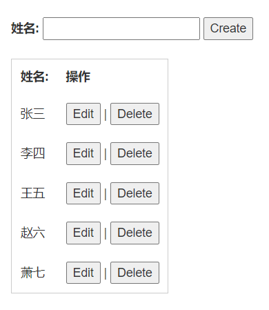

# 生成增删改查代码

## 1 目标

我们的目标，应该是生成通过一个 JSON Schema，就能够生成可以增删改查的代码。下面是我们最初的模板：



而我们之后要做到的，就是在这个模板之上再继续修改。

## 2 模板代码

```html
<!DOCTYPE html>
<html lang="en">
  <head>
    <meta charset="UTF-8" />
    <meta http-equiv="X-UA-Compatible" content="IE=edge" />
    <meta name="viewport" content="width=device-width, initial-scale=1.0" />
    <title>Document</title>
  </head>
  <body>
    <div>
      <div style="margin: 20px">
        <div id="create">
          <form action="javascript:void(0);" method="POST" onsubmit="Create()">
            <label>姓名:</label>
            <input type="text" id="name" />
            <button type="submit">Create</button>
          </form>
        </div>
        <div id="edit">
          <form action="javascript:void(0);" method="POST" id="update">
            <label>姓名:</label>
            <input type="text" id="update_name" />
            <button type="submit">Update</button>
            <button onclick="editHider()">Close</button>
          </form>
        </div>
      </div>
      <div style="margin: 20px">
        <table style="border: 1px solid #ccc">
          <thead>
            <tr>
              <th style="padding: 10px">姓名:</th>
              <th style="padding: 10px">操作</th>
            </tr>
          </thead>
          <tbody id="result"></tbody>
        </table>
      </div>
    </div>
    <script src="./index.js"></script>
  </body>
</html>
```

```javascript
var el = document.getElementById('result');
var names = [];

function Create() {
  var el = document.getElementById('name')
	var name = el.value;
	if (name) {
		names.push(name.trim());
		el.value = '';
	}
	displayData();
};
 
function Delete(item) {
	names.splice(item, 1);
	displayData();
};

function Edit(item) {
	var el = document.getElementById('update_name');
	el.value = names[item];
	document.getElementById('edit').style.display = 'inline';
	document.getElementById('create').style.display = 'none';
	self = this;
 
	document.getElementById('update').onsubmit = function() {
	var name = el.value;
		if (name) {
			self.names.splice(item, 1, name.trim());
			self.displayData();
			buttonToggle();
			document.getElementById('create').style.display = 'inline';
		}
	}
};
 
 
function buttonToggle() {
	document.getElementById('edit').style.display = 'none';
	document.getElementById('create').style.display = 'inline';
}

function displayData() {
	var data = '';
	if (names.length > 0) {
		for (i = 0; i < names.length; i++) {
			data += '<tr>';
			data += '<td style="padding: 10px;">' + names[i] + '</td>';
			data += '<td style="padding: 10px;"><center><button onclick="Edit(' + i + ')">Edit</button> | <button onclick="Delete(' + i + ')">Delete</button></center></td>';
			data += '</tr>';
		}
	}
	el.innerHTML = data;
};
 
 
displayData();
buttonToggle();
```

## 3 生成目标

目前的一个问题是，真的要自己手撸吗？直接进行 JSON 的拼接，感觉很麻烦，还是先把有人教的生成 HTML 部分给编写完成吧。