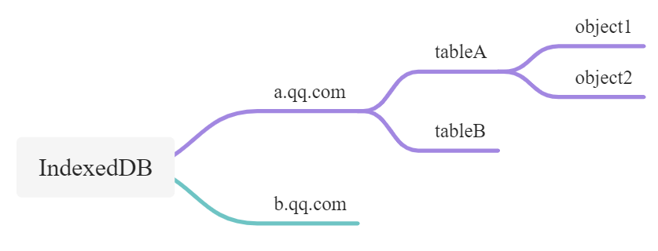

# IndexedDB 的使用

IndexedDB 主要用来客户端存储大量数据。它是按照域名分配独立空间。

一个独立域名下可以创建多个数据库，每个数据库下可以创建多个对象存储空间（表），一个对象存储空间可以存储多个对象数据。



IndexedDB 有以下特点：

- 非关系型数据库
- 持久化存储
- 异步操作
- 支持事务
- 同源策略
- 存储容量大

## 1 IndexedDB 的四个概念

- 仓库 ObjectStore
- 索引 index
- 游标 cursor
- 事务

indexedDB 没有表的概念，它只有仓库 store 的概念，把仓库理解为表就可以了

可以给对应的表添加索引，以便加快查找速率

游标可以想象为一个指针

对数据库进行操作时，如果失败了，就会回滚到最初的状态

## 2 创建或连接数据库

```js
const indexedDB = window.indexedDB || window.mozIndexedDB || window.webkitIndexedDB || window.msIndexedDB
const request = indexedDB.open('dbName', 1)
let db
request.onerror = (event) => {
  console.log('数据库打开报错')
}
request.onsuccess = (event) => {
  db = event.target.result
  console.log('数据库打开成功', db)
}
request.onupgradeneeded = (event) => {
  db = event.target.result
  const objectStore = db.createObjectStore('users', {
    keyPath: 'uuid', // 这是主键
    autoIncreament: true, // 实现自增
  })
  // 创建索引
  objectStore.createIndex('uuid', 'uuid', { unique: true })
  objectStore.createIndex('name', 'name', { unique: false })
  objectStore.createIndex('age', 'age', { unique: false })
}
```

## 3 增加

```js
const newUser = {
  uuid: '962d8de3-5b02-4dd7-b410-421056cc9154',
  name: 'Mike',
  age: 18
}
db.transaction('users', 'readwrite')
  .objectStore('users')
  .add(newUser)
```

## 4 删除（通过主键）

```js
db.transaction('users', 'readwrite')
  .objectStore('users')
  .delete('962d8de3-5b02-4dd7-b410-421056cc9154')
```

## 5 修改（通过主键）

```js
const newUser = {
  uuid: '962d8de3-5b02-4dd7-b410-421056cc9154',
  name: 'Tom',
  age: 20
}
db.transaction('users', 'readwrite')
  .objectStore('users')
  .put(newUser)
```

## 6 查询

### 6.1 通过主键查询

```js
const req = db
  .transaction('users')
  .objectStore('users')
  .get('962d8de3-5b02-4dd7-b410-421056cc2789')
req.onsuccess = (event) => {
  console.log(event.target.result)
}
```

### 6.2 通过游标查询

```js
const list = []
const req = db
  .transaction('users')
  .objectStore('users')
  .openCursor()
req.onsuccess = (event) => {
  const cursor = event.target.result
  if (cursor) {
    list.push(cursor.value)
    cursor.continue()
  } else {
    console.log('游标读取到的数据', list)
  }
}
```

使用上述代码，可以获取数据库中的所有数据。不过也有其他办法可以获取所有数据

### 6.3 查询所有数据

```js
const req = db.transaction('users').objectStore('users').getAll()
req.onsuccess = (event) => {
  console.log('所有数据', event.target.result)
}
```

### 6.4 通过索引查询

```js
const req = db
  .transaction('users')
  .objectStore('users')
  .index('name')
  .get('Tom')
req.onsuccess = (event) => {
  console.log(event.target.result)
}
```

索引查询，只是查出来满足条件的第一条数据

### 6.5 结合索引和游标来查询数据

```js
const list = []
const req = db
  .transaction('users')
  .objectStore('users')
  .index('age')
  .openCursor(IDBKeyRange.only(20))
req.onsuccess = (event) => {
  const cursor = event.target.result
  if (cursor) {
    list.push(cursor.value)
    cursor.continue()
  } else {
    console.log('索引 + 游标查询结果', list)
  }
}
```

其中，`IDBKeyRange` 对象代表数据仓库中的一组主键。它可以包含一个值，也可以指定上限和下限。

- `IDBKeyRange.lowerBound()`：指定下限。
- `IDBKeyRange.upperBound()`：指定上限。
- `IDBKeyRange.bound()`：同时指定上下限。
- `IDBKeyRange.only()`：指定只包含一个值。

以上代码可以理解为，先通过缩小数据的范围——所有有 `age` 属性的数据，然后从第一个开始，通过游标开始查找

### 6.6 通过索引和游标，实现分页查询

`IDBCurosr` 有一个方法 `advance`，可以设置光标应该向前移动其位置的次数

```js
const list = []
let cnt = 0
let skip = true
const pageNo = 1
const pageSize = 5
// 条件查询
const req = db
  .transaction('users')
  .objectStore('users')
  .index('age')
  .openCursor(IDBKeyRange.lowerBound(5))
req.onsuccess = (event) => {
  let cursor = event.target.result
  if (pageNo > 1 && skip) {
    skip = false
    cursor.advance((pageNo - 1) * pageSize)
    return
  }
  if (cursor) {
    list.push(cursor.value)
    cnt++
    if (cnt < pageSize) {
      cursor.continue()
    } else {
      cursor = null
      console.log('分页查询结果', list)
    }
  } else {
    console.log('分页查询结果', list)
  }
}
```

## 7 关闭数据库

```js
db.close()
```


