# 自动软件生成系统的研究与实践

# 摘要

软件行业自诞生以来，它的需求量增长迅速，但生产量却增长缓慢。其原因在于，软件作为人类智慧的产品，需要开发人员手动编码实现，这种生产方式太过落后。

为改进软件的生产方式，学术界和工业界不断地将编译原理、人工智能等其他领域的知识应用到软件开发中，以尝试实现软件生成系统的自动化。

WIDE 是一款结合 Prolog 引擎，模板技术和 CI/CD 技术，能自动生成软件的平台。它提供了一种生成软件系统的新思路：

如果把软件系统看作是一个黑盒，那么黑盒的主要输入是查询条件，主要输出是查询结果。与此类似，如果把 Prolog 专家系统也看作是一个黑盒，那么专家系统的主要输入同样是查询条件，主要输出同样是查询结果。

软件系统和专家系统的不同之处在于，软件系统执行查询的步骤由编写好的程序指定，每一次查询时都无法改变；而专家系统执行查询时，则会首先推理得到最优的执行步骤，然后依据步骤执行查询。相比软件系统，专家系统每一次查询都会多执行了一遍推理。

如果专家系统在第一次推理过后，能”记忆“最优的执行步骤，那么之后系统运行时，只需要按照记忆的步骤执行代码，便没有必要重新推理。这种”记忆“了最优执行步骤、无需推理的专家系统就是一种特别的软件系统。

WIDE 的核心思想便是，首先确定软件功能 ，由 Prolog 引擎推理得到实现软件功能的最优步骤；然后使用模板技术”记忆“最优步骤，并生成业务代码；最后通过 CI/CD 技术部署业务代码，从而实现了自动化的软件生成。

因为 WIDE 的代码并未开源，且相关资料只有官网文档。我们希望借助使用 WIDE 来研究和梳理它的三个步骤和相关知识点。

对应 WIDE 的三个步骤，我们论文主要涉及三个知识点：Prolog（第三章），模板技术（第四章）和 CI/CD（第五章）。

**关键词**：Prolog；专家系统；模板技术；CI/CD

# Abstract

Since the birth of the software industry, its demand has increased rapidly, but its production has increased slowly. The reason is that as a product of human intelligence, software needs to be manually coded by developers, which is too backward.

In order to improve the production mode of software, academia and industry continue to apply the knowledge of compilation principle, artificial intelligence and other fields to software development in order to try to realize the automation of software generation system.

Wide is a platform that combines Prolog engine, template technology and CI / CD technology to automatically generate software. It provides a new idea of generating software system:
If the software system is regarded as a black box, the main input of the black box is the query condition and the main output is the query result. Similarly, if the prolog expert system is also regarded as a black box, the main input of the expert system is also the query conditions, and the main output is also the query results.

The difference between software system and expert system is that the steps of software system executing query are specified by the written program, which cannot be changed every time; When the expert system executes the query, it will first infer the optimal execution steps, and then execute the query according to the steps. Compared with the software system, the expert system performs reasoning once more for each query.

If the expert system can "memorize" the optimal execution steps after the first reasoning, then when the system runs, it only needs to execute the code according to the memorized steps, and there is no need to re reason. This expert system which "memorizes" the optimal execution steps and does not need reasoning is a special software system.

The core idea of wide is to first determine the software function and obtain the optimal steps to realize the software function by Prolog engine reasoning; Then use template technology to "remember" the best steps and generate business code; finally deploy business code through CI / CD technology, so as to realize automatic software generation.

Because the code of wide is not open source, and the relevant materials are only the official website documents. We hope to use wide to study and sort out its three steps and related knowledge points.

Corresponding to the three steps of wide, our paper mainly involves three knowledge points: Prolog (Chapter 3), template technology (Chapter 4) and CI / CD (Chapter 5).

**Keywords**: Prolog; Expert system; Formwork technology; CI/CD

# 目录

[toc]

# 1 绪论

## 1.1 自动软件生成系统的背景

软件行业诞生后，由于缺乏科学理论的指导，以及手工编程的的落后生产方式等各种原因，开发者们面临着软件开发进度慢、开发成本高，产品难以维护等一系列问题，这些问题被称为软件危机。为了解决软件危机，在 1968、1969 年连续召开两次著名的 NATO 会议，并同时提出软件工程的概念。[1]

软件工程总结了软件的生命周期，面向对象思想等一系列科学的开发方法，缓解了软件危机。但手工编程的方式并没有得到改变，因此一部分人尝试将编译原理、人工智能等知识结合软件工程，希望能让软件生产的部分过程实现自动化。

此后自动代码生成的含义便不再局限于编译原理中的后端代码生成，也可以指直接生成 C，Java，JavaScript，Python 和 HTML 等高级程序语言。[2]

在逐步实现编码、测试、集成和部署等步骤的自动化后，一种想法油然而生，是否可以串联多个步骤，实现一个软件系统的自动化生成呢？

2014 年，Forrester Research 发布了一则报告，提出了低代码开发平台（Low-Code Development Platform）这个名称。Platforms that enable rapid delivery of business applications with minimum hand-coding and minimal upfront investment in setup, training, and development.（此平台只需要最小的手工编程，并且在设置、培训和开发方面投资最少）[3]。

2018 年开始，海内外市场开始在低代码上大量投资和研究。根据报道，在特定领域低代码平台的效率甚至能够达到传统开发的 10 倍以上，并且让开发更加敏捷、灵活，方面扩展。[4]

尽管大家都将低代码平台，看作是实现软件系统自动化生成的平台。但其实各低代码平台生成代码的原理，使用的技术可能有很大差别。

本文使用一个名叫 WIDE 的低代码平台，并借由它探讨了一种结合 Prolog 引擎，模板技术和 CI/CD 技术，自动生成软件系统的新思路——即首先确定软件功能 ，由 Prolog 引擎推理得到实现软件功能的最优步骤；然后使用模板技术”记忆“最优步骤，并生成业务代码；最后通过 CI/CD 技术部署业务代码，从而实现了自动化的软件生成。

## 1.2 国内外研究现状

### 1.2.1 自动软件生成系统的研究现状

为自动生成软件系统，基于不同的理论和假设，国内外的不同团队提出了形形色色的生成方法。主流方法有：

（1）基于模板的代码生成

基于模板的代码生成技术将代码看为两部分的组合，一部分经常变动，称为 data（数据），而另一部分则不常改变，称为 template（模板）。例如网页的文字内容是经常变化的，便可以看作数据，而网页的样式等则不常改变，可以看作模板。

template 中，会提前用特殊标签，给动态生成的 data 预留着适合的位置，最终模板引擎（template engine）会将 data 替换掉特殊标签，从而生成可以实际运行的代码。

基于模板的代码生成技术是一种应用广泛的代码生成技术，它不仅能生成简单的 HTML，XML 等标记语言，也能生成 PHP 等高级语言。文献 [2] 中提出了一种利用 XML 文件定义数据和和模板，并利用模板引擎生成代码的方法；文献 [5] 中提到了一种利用 Java 编写的模板引擎 FreeMarker 生成 Word 文档和 Excel 的方法；文献 [6] 中设计了能够生成 PHP 代码的模板引擎。

（2）基于模型的代码生成

基于模型的代码生成技术，一般会建立能描述软件功能的模型，在通过多种技术手段将模型转变为特定代码。所建立的模型越精简，生成的代码效率也越高。

文献 [7] 中讲述了如何利用 Simulink/Stateflow 建模最后生成 C 语言；文献 [8] 提到了模型可以生成用户界面的代码；文献 [9] 则是利用程序流程图建模，来生成代码；文献 [10] 则是提到模型驱动架构（Model-Driven Architecture，简称 MDA）方法，它一般会使用 UML 语言首先建立通用的模型（平台无关模型），再在通用模型的基础上进一步得到业务的专用模型（平台相关模型），最后再转换生成代码；文献 [11] 则是使用 UML 语言建模并将建模转换为 Java 代码。

（3）基于对象关系映射的代码生成

基于对象关系映射（Object Relational Mapping，简称 ORM）的代码生成，是一种用于生成 SQL 代码的方法。面向对象编程是软件工程的概念，而关系型数据库中的关系则是数学概念，二者之间有明显的差异。而对象关系映射的代码生成，目的则是让开发者像操作对象那样操作数据库。

文献 [12] 介绍了 Java 语言的 ORM 框架 Hibernate；文献 [13] 则是介绍了 PHP 语言的 ORM 框架 Doctrine；文献 [14] 则是提到了谈及使用 Java 的 Hash Map 来实现 ORM 框架。

虽然代码生成的三种方法各部相同，但在实际研究与应用中，三种方法通常会结合使用。比如基于模型的代码生成，在最后将建模转换为代码时，往往也需要使用模板。部分 ORM 框架也会结合模板文件以生成 SQL 语言。

### 1.2.2 Prolog 的研究现状

Prolog 是一门基于一阶谓词逻辑的数学逻辑而开发的语言。1973  年 Prolog 语言被设计出来后，它广泛应用于知识推理，以及专家系统中。作为一门符号主义人工智能思想下的推理语言，由于近些人工智能的连接主义和行为主义思想的兴盛，Prolog 的相关研究并不引人注目。

目前 Prolog 的研究方向，主要有结合结合高级语言开发专家系统，结合 Prolog 和关系数据库构建演绎数据库等。文献 [15] 介绍了 C++ 和 Prolog 共同开发的专家系统；文献 [16] 介绍了 Java 和 Prolog 结合开发的教学评价专家系统；文献 [17] 则是介绍了如何从一般的关系数据库中提取知识生成 Prolog 的知识库；文献 [18] 则结合 Prolog 和 DBMS 系统，使用子句间优化技术，让 Prolog 从数据库中不重复地提取事实规则。

### 1.2.3 模板技术的研究现状

1.2.1 一节中提到基于代码模板的代码生成方法，是由数据 data 和模板 template 组合而成，而组合它们需要的工具是模板引擎（template engine）。

模板引擎的实现理论——编译原理发展已经很成熟，因此目前国内外研究方向，并非是模板引擎的实现，而是对模板引擎的效率、优势的改进。文献 [19] 提到为了减少服务器带宽的消耗，把一般由服务器使用的模板引擎交由客户端来使用。文献 [20] 提到为了加快生成代码的速度，使用 C 语言编写模板引擎，并结合 FLEX 和 BISON 加速词法分析和语法分析。文献 [21] 提到为了提高模板引擎的执行效率，在模板引擎中引入 LRU 缓存算法机制。文献 [22] 提到为了保证模板引擎的安全性，在词法分析时检测是否包含危险函数。文献 [23] 提到为了增加模板引擎的特定功能，使用 jQuery 编写模板引擎。

### 1.2.4 CI/CD 的研究现状

所谓 CI，是指持续集成技术（Continuous Integration）。而 CD 是指持续部署技术（Continuous Deployment）。

因为软件行业对自动化集成和部署的需求增加，所以持续集成和持续部署技术被开发了出来。因为 CI/CD 工具更多在工业界使用，所以目前的论文大都是对相关实践经验和工具的介绍。文献 [24] 研究 GitHub 提供的持续集成相关功能。文献 [25] 研究 Jenkins Ansible 自动化实现持续集成和持续部署。文献 [26] 则介绍持续集成的思维模式和实践方法。文献 [27] 则提到持续集成已经被开源项目广泛使用，并且越来越多的开源项目将会使用持续集成工具。

## 1.3 论文的结构

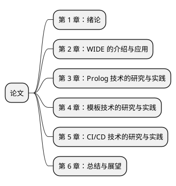

<center>图 1-1 本文的内容组织</center>

全文分为 6 章：

- 第 1 章是绪论，我们首先介绍了自动软件生成的背景，并提出了生成代码的一种新思路。接着我们介绍了自动软件生成技术的研究现状，以及新思路中三种技术的研究现状；最后我们则介绍了全文的结构安排。
- 第 2 章我们应用 WIDE 生成了一个学生信息管理系统，并介绍 WIDE 生成代码的核心思想和应用的三种技术。
- 第 3 章我们介绍了 Prolog 技术。主要探究 Prolog 能不能模拟软件系统，并记忆推理过程，且经过推理过程得到最优的执行步骤。首先我们介绍 Prolog 的产生背景和数学理论。随后我们介绍 Prolog 的基本语法，接着我们将使用 Prolog 模拟关系数据库的增删改查操作，以验证当把软件系统和专家系统看为黑盒时，二者的输入输出是十分相似的。之后我们利用 JavaScript 模拟 Prolog 的推理原理。在模拟的基础上，我们尝试探索能不能把通过推理过程得到最优的执行步骤。
- 第 4 章我们介绍模板技术。主要探究如果能拿到数据，应该如何结合数据生成代码。为此我们先介绍市面上的模板引擎如何使用，为探究模板引擎的原理自己实现了一个模板引擎。然后我们利用市面上的模板引擎结合数据，生成了两个常见的商业应用。其一，读取 Markdown 文件生成 HTML 的静态博客生成器；其二，拖拽组件生成 HTML 的可视化编辑器。
- 第 5 章我们介绍 CI/CD 技术。主要探究如果能够生成代码，应该如何将生成的代码加以部署。我们会比较传统的集成部署与自动化的继承部署的区别，最后我们会使用 GitHub Actions 将第 4 章中实现的商业应用加以部署。
- 第 6 章是总结章，总结我们取得的成果，以及研究的不足。并给出若进一步研究时需要注意的部分。

# 2 WIDE 的介绍与应用

## 2.1 WIDE 的介绍

2022 年，我们接触到一款支持前端页面设计、服务端代码自动生成，自动完成数据库设计等功能的集成开发工具——WIDE（Web Integrated Development Environment，网络集成开发环境）。

WIDE 是一个能够开发 HTML5 应用，微信应用，Android/iOS 应用以及标准 PC 软件（Windows，Linux，Mac OS）的集成开发环境。它有一个可视化编辑器，开发者在编辑页面时，不必编写 HTML，CSS 等代码，而是可以直接拖拽组件。

WIDE 目前分为 1.0 版本和 2.0 版本，1.0 版本是一个软件，需要下载并配合虚拟机使用，而 2.0 版本尚在开发中。二者的地址分别为：（1）WIDE 1.0：https://www.wware.org/；（2）WIDE 2.0：https://www.prodvest.com/。

## 2.2 WIDE 的特点

如果只看 WIDE 的表面特点，那么它和其他的低代码平台大同小异。WIDE 和其他平台最大的不同它生成代码的特殊思路，也就是我们将要探究的方法。


<center>图 2-1 将软件系统和专家系统都看为黑盒</center>

如果把软件系统看作是一个黑盒，那么黑盒的主要输入是查询条件，主要输出是查询结果。与此类似，如果把 Prolog 专家系统也看作是一个黑盒，那么专家系统的主要输入同样是查询条件，主要输出同样是查询结果。

软件系统和专家系统的不同之处在于，软件系统执行查询的步骤由编写好的程序指定，每一次查询时都无法改变；而专家系统执行查询时，则会首先推理得到最优的执行步骤，然后依据步骤执行查询。相比软件系统，专家系统每一次查询都会多执行了一遍推理。

如果专家系统在第一次推理过后，能”记忆“最优的执行步骤，那么之后系统运行时，只需要按照记忆的步骤执行代码，便没有必要重新推理。这种”记忆“了最优执行步骤、无需推理的专家系统就是一种特别的软件系统。

WIDE 的核心思想便是，首先确定软件功能 ，由 Prolog 引擎推理得到实现软件功能的最优步骤；然后使用模板技术”记忆“最优步骤，并生成业务代码；最后通过 CI/CD 技术部署业务代码，从而实现了自动化的软件生成。

如果使用 WIDE 完整开发一个软件，它需要的流程如下所示：

（1）梳理业务逻辑，确定需求，也就是 Prolog 需要推理的目标。这一部分工作由领域专家和需求分析师使用 BPMN 进行建模完成。

（2）设计页面，这一部分由产品工程师使用可视化的编辑器完成，我们在第 4 章实现了类似工具。

（3）标注页面元素的数据，设定逻辑事件之间关系，这一部分由程序员完成。

（4）生成单页面的信息结构。这一部分由 WIDE 内置的 SWI-Prolog 引擎完成。

（5）转换信息结构为前端代码和后端代码。这一部分由 WIDE 内置的编译系统完成。

（6）将生成的软件加以集成部署。这一部分由 CI/CD 工具完成。

## 2.3 WIDE 生成的学生信息管理系统

我们使用了 WIDE 1.0（2.0 没有开发完成），生成了一个典型的学生信息管理系统。它包含了 11 个页面。每个页面又包含常见的 HTML 元素，包括列表、表格、按钮、标题和表单等多种 HTML 元素。

| 页面     | 路径                                     | 图片                                       |
| -------- | ---------------------------------------- | ------------------------------------------ |
| 首页     | http://wide.lijunlin.xyz/index.html      |       |
| 我的桌面 | http://wide.lijunlin.xyz/dashboard.html  |   |
| 通知公告 | http://wide.lijunlin.xyz/notice.html     |      |
| 学期课表 | http://wide.lijunlin.xyz/course.html     |      |
| 教学日历 | http://wide.lijunlin.xyz/daily.html      |       |
| 选课管理 | http://wide.lijunlin.xyz/selection.html  |   |
| 考试安排 | http://wide.lijunlin.xyz/exam.html       |        |
| 学生评教 | http://wide.lijunlin.xyz/evaluation.html |  |
| 课程成绩 | http://wide.lijunlin.xyz/score.html      |       |
| 个人信息 | http://wide.lijunlin.xyz/info.html       |        |
| 毕业设计 | http://wide.lijunlin.xyz/graduation.html |  |

<center>表 2-1：WIDE 生成的学生信息管理系统图片</center>


# 3 Prolog 技术的研究与实践

## 3.1 本章内容安排

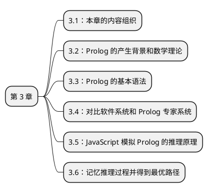

<center>图 3-1 第 3 章内容组织</center>

由于本章节内容比较复杂，因此在开始之前，有必要简要描述本章的结构安排。

本章主要探究的问题是，Prolog 是否可以模拟软件系统，并能够记忆自身的推理过程。

本章分为 5 部分：

- 第 1 部分介绍本章的内容组织。
- 第 2 部分介绍 Prolog 的产生背景和数学理论。
- 第 3 部分介绍 Prolog 的基本语法。
- 第 4 部分利用对比软件系统和 Prolog 专家系统。我们使用 Prolog 模拟了关系数据库的增删改查操作，验证当把软件系统和专家系统看为黑盒时，二者的输入输出是十分相似的。
- 第 5 部分则利用 JavaScript 编写代码，探究是否可以用 JavaScript 模拟 Prolog 的推理过程。
- 第 6 部分则探究能否记忆下推理的过程，并是否能得到最优的执行路径


## 3.2 Prolog 的产生背景和数学理论

1956 年，John McCavthy 等 4 位学者在 Dartmouth 大学提出用人工智能（Artificial Intelligence）作为让机器具备智能的交叉学科的名字。那么，什么是智能呢？知识阈值理论认为一个系统具备智能是因为它拥有大量知识，并能在包含众多知识的搜索空间内，快速找出解决问题的答案。[28] 而围绕如何表示知识，以及如何快速找到答案有着一系列研究成果。

因为谓词逻辑能够精确地表达知识的含义，所以得到了广泛应用。1973 年，Alain Colmerauer 等人基于一阶谓词逻辑创造了 Prolog 语言。

为进一步了解 Prolog 语言，我们需要简单了解命题逻辑和谓词逻辑。

命题逻辑中，命题是能够判断真假的陈述句，它可以通过否定联结词 ¬，合取联结词 ∧，析取联结词 ∨ 和蕴含联结词 → 等形成新的命题。

比如有一个命题如下：

```
p: 2 是素数
q: 4 是素数
```

则，¬p，p ∧ q，p ∨ q，p → q 等都是命题。

在命题逻辑的基础上，引入全称量词 ∀ 和存在量词 ∃，以表达出个体和总体之间的内在联系和数量关系，这就是谓词逻辑，也被称为一阶逻辑或者一阶谓词逻辑[29]

比如如下例子：

```
所有偶数都是有理数:
  F(x) 表示偶数是有理数，上述命题用 ∀xF(X) 表示
有的素数是偶数:
  G(x) 表示素数是偶数，上述命题用 ∃xF(x) 表示
```

在一阶谓词逻辑的基础上，可以运用推理规则求解特定问题的答案。由于 Prolog 是基于一阶逻辑的，它也能求解一些特定问题的答案。

## 3.3 Prolog 的基本语法

下面我们介绍 Prolog 的基本语法，Prolog 大致上可以分为简单类型（simple terms）和复杂类型（complex terms）。

其中简单类型又可以分为变量（variable）和常量（constant）。变量的首字符由 `A~Z`，和 `_` 组成，其余字符由 `A-Z`，`a-z` 和 `_` 组成。

常量则又可以分为原子（atom）和数字（number）。

原子有 3 个组成部分。

- 普通字符，首字符由 `a-z` 组成，其余字符由 `A-Z`，`a-z` 和 `_` 组成。
- 被单引号 `''` 包围的字符。
- 特殊的字符，比如 `,` 代表 `and`

数字也有 3 个组成部分。

- 整数、浮点数
- 操作符，比如加 `+` ，减 `-`，乘 `*`，除 `/`
- 数学函数，比如随机数 `random`，绝对值 `abs`，最小值 `min` 和最大值 `max` 等。

复杂类型由简单类型组成，全部由常量组成的称为事实（fact），有变量参与组成的称为规则（rule）。

比如：

```prolog
% 事实，代表 michael 是 anthony 的父亲或者母亲
parent(michael, anthony).
% 事实，代表 kay 是 anthony 的父亲或者母亲
parent(kay, anthony).
% 事实，代表 michael 是男性
male(michael).
% 事实，代表 kay 是女性
female(kay).

% 规则，如果 X 是女性，且 X 是 Y 的父亲或母亲，那么 X 就是 Y 的母亲
mother(X, Y) :- parent(X, Y), female(X).
% 规则，如果 X 是男性，且 X 是 Y 的父亲或母亲，那么 X 就是 Y 的父亲
father(X, Y) :- parent(X, Y), male(X).
```

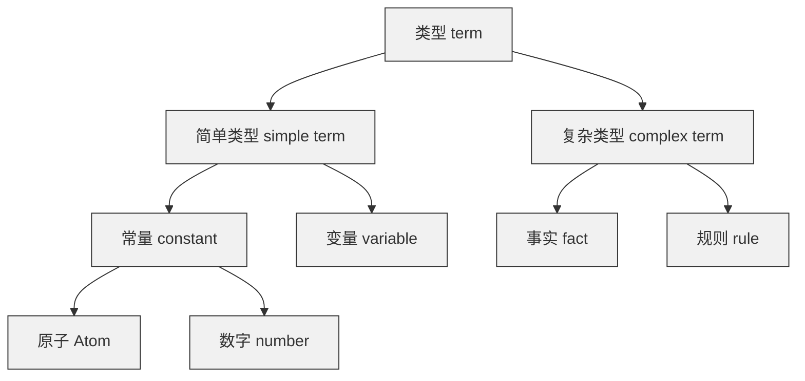

<center>图 3-2 Prolog 的基本语法</center>

## 3.4 对比软件系统和 Prolog 专家系统

如果要提取软件系统最核心的一个部分，那无疑是关系数据库。所有的用户操作，均可以简单地认为是对关系数据库进行增删改查。而关系数据库的增删改查，我们可以使用 Prolog 的代码来轻松模拟。

我们举一个常见的例子，假设关系数据库中现有一张用户表 users，记录了用户的个人信息。

| id   | name  | gender | age  | is_del |
| ---- | ----- | ------ | ---- | ------ |
| 1    | tom   | male   | 20   | 0      |
| 2    | jerry | male   | 22   | 0      |
| 3    | mike  | male   | 23   | 0      |
| 4    | mary  | female | 21   | 0      |

<center>表 3-1：用户个人信息表 users</center>

我们可以使用 Prolog 的一个脚本文件来模拟这张用户信息表：

```prolog
user([id(1), name(tom), gender(male), age(20), is_del(0)]).
user([id(2), name(jerry), gender(male), age(23), is_del(0)]).
user([id(3), name(mike), gender(male), age(23), is_del(0)]).
user([id(4), name(mary), gender(female), age(21), is_del(0)]).
```

不难想到，当用户表进行增加、删除和修改时，也只需要将 Prolog 脚本文件中的相关记录增加、删除和修改，即可实现 Prolog 脚本文件和数据库表一一对应。剩余有疑问的操作便是查询，Prolog 是否能模拟关系数据库的查询操作呢？

首先我们来看一下简单查询，下面使用 SQL 查询 name 为 tom 的用户信息：

```sql
SELECT * FROM users WHERE name = tom;
```

对应的 Prolog 的查询代码可以这样写，它的意思是查找 P，P 是一个用户，且这个用户的 name 为 tom。

```prolog
user(P), member(name(tom), P).
```

我们再来看一下复杂查询，假设除了用户信息表 users 之外，还有一个朋友关系表 friends，记录了用户的好友关系。它的三条记录分别代表着 tom 和 jerry 是朋友，tom 和 mike 是朋友，mary 和 tom 也是朋友。

因为朋友关系是双向的，所以 Jerry 和 tom 是朋友，mike 和 tom 是朋友，tom 和 mary 也是朋友。

| id   | user_id1 | user_id2 |
| ---- | -------- | -------- |
| 1    | 1        | 2        |
| 2    | 1        | 3        |
| 3    | 4        | 1        |

<center>表 3-2：朋友关系表 friends</center>

现有一个复杂查询，查询 tom 的朋友。

因为朋友关系是双向的，如果我们要查询 tom 的朋友，我们不仅要查询 user_id2 为 1 的字段，还要获取 user_id1 为 1 的字段，最后将两次的查询结果取合集，如下所示。

```sql
SELECT name FROM users where id in (
  SELECT user_id2 AS ids FROM friends WHERE user_id1 = 1
  UNION ALL
  SELECT user_id1 AS ids FROM friends WHERE user_id2 = 1
)
```

如果使用 Prolog，我们首先用一个脚本文件把两张表的数据表示一下：

```prolog
user([id(1), name(tom), gender(male), age(20), is_del(0)]).
user([id(2), name(jerry), gender(male), age(23), is_del(0)]).
user([id(3), name(mike), gender(male), age(23), is_del(0)]).
user([id(4), name(mary), gender(female), age(21), is_del(0)]).

friend(id(1), id(2)).
friend(id(1), id(3)).
friend(id(4), id(1)).
```

而我们可以定义一个朋友规则，来说明朋友关系是确定的，然后再给出 Prolog 的查询语句：

```prolog
friend(X, Y) :- friend(Y, X).

friend(id(1), ID), user(P), member(ID, P).
```

可以看到，Prolog 不仅能表示关系数据库的复杂查询，甚至能表示形式更加简洁。

因此我们做出一个判断，那便是当把软件系统和专家系统都看为是一个黑盒时，它们的输入输出是一样的。

## 3.5 利用 JavaScript 模拟 Prolog 的推理原理

接下俩我们将探究 Prolog 是如何推理的：

我们以亲属关系为例子，下面是电影《教父》中部分家庭成员的关系图。


<center>图 3.3：家庭成员关系图</center>

关系图分为三层：

- 第一层是 vito 和 carmela
- 第二层是 sonny, fredo, conie, michael 和 kay
- 第三层是 anthony

其中，vito 和 carmela 是 sonny, fredo, conie 和 michael 的双亲，michael 和 kay 是 anthony 的双亲。

而 vito，sonny，fredo，michael 和 anthony 是男性，carmela, conie 和 kay 是女性。

这些信息就是 Prolog 中的事实，可以用代码表示如下：

```prolog
parent(vito, sonny).
parent(carmela, sonny).
parent(vito, fredo).
parent(carmela, fredo).
parent(vito, conie).
parent(carmela, conie).
parent(vito, michael).
parent(carmela, michael).
parent(michael, anthony).
parent(kay, anthony).
male(vito).
male(sonny).
male(fredo).
male(michael).
male(anthony).
female(carmela).
female(conie).
female(kay).
```

如果我们要查询谁是 anthony 的母亲，我们可以先定义规则 mother(X, Y)，此规则的意思是 X 是 Y 的母亲。接着我们可以通过 mother(Who, anthony) 来查询，Prolog 会根据已知的事实利用规则来进行推理，最后得知答案，Who = kay。

```prolog
mother(X, Y) :- parent(X, Y), female(X).
mother(Who, anthony).
```

如果我们要查询谁是 michael 的兄弟，我们也需要定义规则 brother(X, Y)，然后利用 brother(Who, michael) 来查询。

```prolog
brother(X, Y) :- parent(Z, X), parent(Z, Y), male(X), X \== Y.
brother(Who, michael)
```

我们应该如何用 JavaScript 模拟上面的推理过程呢？首先必须考虑的问题是，在 JavaScript 中应该如何表示亲属关系？因为一个人只有一个母亲和一个父亲，所以我们可以将家庭成员关系图倒过来观察，这样就变为了多棵二叉树。

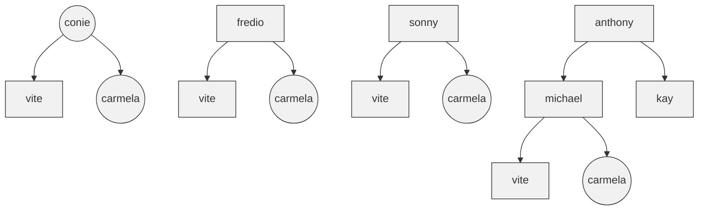

<center>图 3-4：多棵二叉树表示亲属关系</center>

而在 JavaScript 中，我们可以以对象的方式表示二叉树，下面我们用对象表示 Anthony 为根节点的二叉树，一个对象 4 个属性，其中 name 代表姓名，gender 代表性别，father 是指向其父亲的指针，mother 是指向其母亲的指针。

```js
const tree1 = {
  name: 'anthony',
  gender: 'male',
  father: {
    name: 'michael',
    gender: 'male',
    father: {
      name: 'vite',
      gender: 'male',
      father: null,
      mother: null
    },
    mother: {
      name: 'carmela',
      gender: 'female',
      father: null,
      mother: null
    }
  },
  mother: {
    name: 'kay',
    gender: 'female',
    father: null,
    mother: null
  }
}
const tree2 = { /* ... */ }
const tree3 = { /* ... */ }
const tree4 = { /* ... */ }
const trees = [tree1, tree2, tree3, tree4]
```

如果我们要需寻找 anthony 的母亲，在使用 JavaScript 的情况下，我们该使用什么方法来模拟 Prolog 的推理过程呢？一个简单的办法是，遍历所有的节点，寻找代表 anthony 自己的节点 node，然后通过 `node.mother` 找到 anthony 母亲的节点，返回 `node.mother.name`。

这就是深度优先算法，我们可以利用递归函数来实现所有节点的遍历，它的代码如下：

```js
// 二叉树的根节点是 root, 要找 x 的母亲
const getMother = function (root, x) {
  if (root === null) {
    return null
  }
  if (root.name === x && root.mother !== null) {
    return root.mother.name
  }
  return getMother(root.father, x) || getMother(root.mother, x)
}

// 从一堆二叉树中, 寻找 x 的母亲
const getMotherFromTrees = function (trees, x) {
  let mother = null
  for (const item of trees) {
    mother = mother || getMother(item, x)
  }
  return mother
}
```

如果我们需要查询谁是 michael 的兄弟，在使用 JavaScript 的情况下，我们需要先找到 michael 的母亲 carmela，然后找到 michael 父亲 vite。接下来我们要找到和 michael 同父同母的男性，就是他的兄弟。

```js
// getFather, getFatherFromTrees 同 getMother, getMotherFromTrees 类似

const getBrother = function (root, mother, father, arr) {
  if (root.mother === null) { return }
  if (root.father === null) { return }
  if (
    root.mother.name === mother &&
    root.father.name === father &&
    root.gender === 'male'
  ) {
    arr.push(root.name)
    return
  }
  getBrother(root.father, mother, father, arr)
  getBrother(root.mother, mother, father, arr)
}

const getBrotherFromTrees = function (trees, x) {
  // 先找到 x 的母亲和父亲
  const mother = getMotherFromTrees(trees, x)
  const father = getFatherFromTrees(trees, x)
  const brother = []
  for (const item of trees) {
    getBrother(item, mother, father, brother)
  }
  return brother.filter(v => v !== x)
}
```

在 JavaScript 代码中，我们大量使用了深度优先搜索来查找答案，当发现在一个状态没有找到解决问题的答案时，就会回溯为原来的状态，并尝试其他的解决路径。Prolog 也是基于深度优先搜索来寻找答案的，当能够找到答案时，它会返回答案，否则便返回 false。

## 3.6 记忆推理过程并得到最优路径

通过 JavaScript 模拟 Prolog 执行的一节，我们得到结论，Prolog 表示的家属关系，可以使用 JavaScript 的二叉树来表示。Prolog 的家属推理过程，和 JavaScript 搜索答案一样，是基于深度优先搜索。

现在我们则继续使用 JavaScript 来模拟探究一个问题，是否可以记忆推理家属关系的过程并得到最优推理路径呢？

现在我们将这个问题加以抽象，假设有如下的二叉树，记忆推理家属关系，可以看作是记录从根节点到指定节点的深度优先搜索时经过的步骤，而寻找最优推理路径则是寻找从根节点到指定节点的最短路径。

假设指定节点是 4，那么记忆的推理路径是 0->1->3->5->7->8->4，而最优推理路径则是 0->1->4。

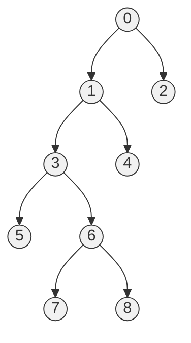


<center>图 3-5 更复杂的家属二叉树</center>

这个家属树可以用 JavaScript 代码表示如下：

```js
const tree = {
  val: '0',
  left: {
    val: '1',
    left: {
      val: '3',
      left: { val: '5', left: null, right: null },
      right: {
        val: '6',
        left: { val: '7', left: null, right: null },
        right: { val: '8', left: null, right: null }
      }
    },
    right: { val: '4', left: null, right: null }
  },
  right: { val: '2', left: null, right: null }
}
```

我们首先探究第一个问题，如何记忆推理的过程？一个很自然的想法便是，深度优先搜索每遍历一个节点，便把该节点加入到栈中。我们改造 3.5 一节中 getMother 代码，增加一个栈用以记录推理步骤：

```js
const getNode = function (root, node, stack) {
  if (root === null) {
    return null
  }
  stack.push(root.val)
  if (root.val === node) {
    return root.val
  }
  return getNode(root.left, node, stack) || getNode(root.right, node, stack)
}
```

现在我们探讨第二个问题，如何得到最短路径？一个很自然的想法是，每当要进入下一个节点前，先把节点 push 入栈。一旦发现所走的路径不正确，需要回溯时，则把原本的 push 入栈的节点从栈中 pop 出来，这样记忆下来的就是最优的执行路径。

用代码表示如下：

```js
const getNode = function (root, node, stack) {
  if (root === null) {
    return null
  }
  stack.push(root.val)
  if (root.val === node) {
    return root.val
  }
  let ans1 = getNode(root.left, node, stack)
  if (ans1) {
    return ans1
  }
  let ans2 = getNode(root.right, node, stack)
  if (ans2) {
    return ans2
  }
  stack.pop()
  return null
}
```

类比 JavaScript 的二叉树推理，我们也可以断定，Prolog 推理过程中，一定也可以记忆推理的步骤并得到最优的推理步骤。 

# 4 代码的自动生成

## 4.1 本章内容安排

本章探究的主要问题是，如何拿到了 Prolog 推理引擎得到的最优推理步骤数据，应该如何生成代码。此时我们面临着一些问题：

（1）在第 3 节中，我们虽然使用 JavaScript 模拟 Prolog 推理后，得到理论上可以拿到 Prolog 的最优推理步骤数据的结果。但 Prolog 最优推理数据的表示，以及如何从 Prolog 引擎中获取最优推理数据，还尚待解决。

（2）如果要生成一个完整的软件系统，只生成推理部分的代码是不够的，还需要生成用户操作界面的代码。

本章节中我们选用生成 HTML 代码来介绍模板技术。原因如下：

（1）依据数据生成 JavaScript 代码，和依据数据生成 HTML 代码，原理其实是一致的，只是一个以后使用的是 JavaScript 模板，一个使用 HTML 模板。

（2）生成软件系统是操作界面需要用到 HTML 模板，以 HTML 为例对后续研究更有帮助。

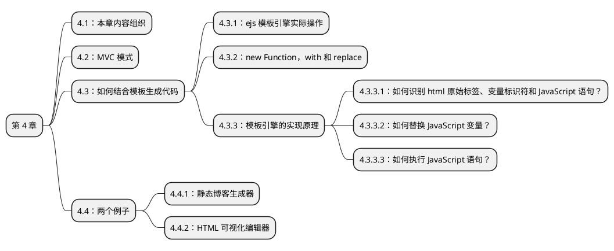

<center>图 4-1：第三章的内容组织</center>

本章分为 4 部分：

- 第 1 部分介绍本章的内容组织。

- 第 2 部分介绍 MVC 模式。

- 第 3 部分则介绍如何结合模板生成代码。

  - 首先我们会使用一个叫 ejs 的模板引擎实际操作。

  - 然后我们会补充 JavaScript 中 new Function，with 以及 replace 三个方法。

  - 接着我们会阐述模板引擎实现的原理，在阐释原理过程中，我们实现了一个简易的模板引擎。实现时我们主要考虑三个问题：

    - 如何识别 HTML 原始标签、JavaScript 变量和 JavaScript 语句？
    - 如何替换 JavaScript 变量？
    - 如何执行 JavaScript 语句？

    解决这三个问题后。我们将阐述模板引擎和编译原理的关系。

- 第 4 部分用 2 个例子说明模板引擎生成代码的实际应用。

  - 第一个例子，读取 Markdown 文件生成 HTML 的静态博客生成器。
  - 第二个例子：拖拽组件生成 HTML 的可视化编辑器。

## 4.2 MVC 模式

现如今大多数的软件开发，都采用了 MVC 模式，WIDE 在使用代码模板时同样如此。

MVC 模式是施乐帕罗奥多研究中心（Xerox PARC）在 20 世纪 80 年代为程序语言 Smalltalk 发明的一种软件架构。[30] 它分为 Model，View 和 Controller 三部分。MVC 模式分离了数据的处理，数据的表示和数据的转发，降低了程序的耦合度。

其中：

- Model 意为模型，负责数据的存储和处理，主要和数据库进行沟通；
- View 意为视图，负责数据的展示；
- Controller 意为控制器，负责连接 View 和 Model，当 View 需要获取数据时，由 Controller 转发它的请求给 Model。

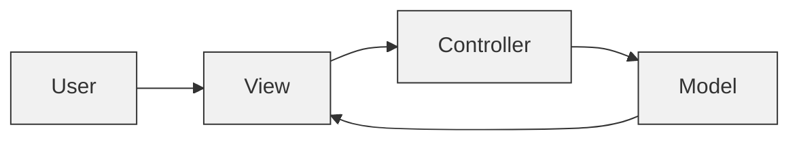

<center>图 4-2：简单的 MVC 模式</center>

理想情况下，用户 User 只操作 View，View 的所有请求都交由 Controller 处理，Controller 再把请求分发给 Model，Model 处理好数据后，把数据返回给 View，也即 MVC 三部分之间应该是单向通信关系。

但在实际应用中，通信方式会更加灵活一些。偶尔我们还能见到用户 User 直接操作 Controller 的情况，比如用户直接在浏览器上输入地址发送请求，便是直接访问了 Controller。Controller 直接操作 View 等情况，比如所访问的资源不存在，Controller 直接将用户的请求定位到 404 NOT Found 界面。

## 4.3 如何结合模板生成代码？

### 4.3.1 实际使用模板引擎

我们首先实际体会以下真实的模板引擎，以 ejs 为例。

ejs 是一款轻量的模板引擎，它的语法是在 HTML 内部嵌入一些特殊标签，最后能够将这些标签替换，生成 HTML 标签。官网是 https://ejs.co/，我们可以到 https://github.com/mde/ejs/releases/tag/v3.1.7 上下载 ejs.min.js。用 script 标签在 HTML 中引入使用。

下面我们举一个例子来说明模板引擎的使用方法：

假设数据是一个长度为 3 的数组，数组中的每一项是一个水果对象。每个对象有 name 和 weight 两个属性：

```js
const data = [
  { name: 'apple', weight: '2kg' },
  { name: 'banana', weight: '3kg' },
  { name: 'pear', weight: '4kg' }
]
```

我们希望将这个数组表示为 HTML 的无序列表，如下所示：

```html
<ul>
  <li>apple: 2kg</li>
  <li>banana: 3kg</li>
  <li>pear: 4kg</li>
</ul>
```

为方便起见，我们将代码写在 script 标签中：

```html
<script src="ejs.min.js"></script>
<script>
const data = [
  { name: 'apple', weight: '2kg' },
  { name: 'banana', weight: '3kg' },
  { name: 'pear', weight: '4kg' }
]

const template = `<ul>
  <% for (const item of data) { %>
    <li><%= item.name %>: <%= item.weight %></li>
  <% } %>
</ul>`

const html = ejs.render(template, { data: data })

console.log(html)
</script>
```

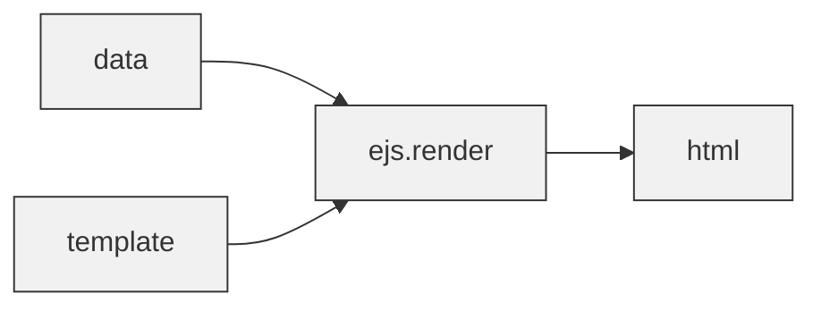

<center>图 4-3：data 和 template 经过 render 函数生成 html 代码</center>

整个代码执行的过程可以用上图表示，代码的核心是函数 ejs.render。ejs.render 的输入是 data 以及 template，输出是 html。

### 4.3.2 new Function，with 以及 replace

在 3.3.3 一节，模板引擎的实现原理中，我们将用 JavaScript 实现一个模板引擎，为了方便理解之后的代码，有必要补充三个方法。

前两个方法在 JavaScript 分别是 new Function 和 with，它们并不常用。

第三个方法是 replace，它有两个参数。通常情况下两个参数都是字符串类型，但我们使用时，这两个参数一个是正则类型，一个是函数类型。

#### 4.3.2.1 new Function

new Function 的语法如下：

```js
const func = new Function([arg1, arg2, ...argN], functionBody)
```

- `arg1` 到 `argN` 是要传递给 `functionBody` 的参数
- `functionBody` 是函数体

使用 new Function 能够创建一个可执行的函数，举个例子：

```js
const sum = new Function('a', 'b', 'return a + b')
console.log(sum(2, 6))
// 结果为: 8
```

#### 4.3.2.2 with

with 语句是一个用于扩展 JavaScript 作用域的语句，语法如下：

```js
with (expr) {
  //...
}
```

- `expr` 便是要扩展到的作用域

扩展作用域听起来比较抽象，因此我们举如下的例子：

```js
const num = 1
const obj = { num: 4 }
function fn1 () {
  const num = 2
  console.log('not extended:', num)
}
function fn2 () {
  const num = 3
  with (obj) {
    console.log('extended:', num)
  }
}
fn1() // not extended: 2
fn2() // extended: 4
```

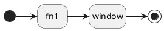

<center>图 3.4：未拓展时的作用域链</center>

未拓展作用域的情况下，JavaScript 在作用域链上查找变量是由内到外，逐级查找的，以上述代码中的 fn1 为例，它查找 num 时，首先在 fn1 的作用域寻找，如果没有寻找到，则会继续到全局作用域 window 上寻找。

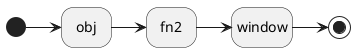

<center>图 3.5：拓展后的作用域链</center>

而在拓展作用域的情况下，JavaScript 会首先查找拓展作用域。因此它查找 num 时，首先会在 obj 的作用域中寻找。这也是为什么 fn2 打印的 num 会是 4。

#### 4.3.2.3 replace

replace 方法，顾名思义，是替换字符串的方法，它的语法如下：

```js
const newStr = str.replace(regexp|substr, newSubstr|function)
```

我们主要介绍不常使用的两个参数：

- `regexp`：这是正则表达式，它可以依据正则规则匹配字符串中的特定内容
- `function`：当 `regexp` 匹配到字符串后，便执行此函数。

举例如下：

```js
const str = 'Hello World'
const newStr = str.replace(/H(ell)(o)/g, function ($0, $1, $2) {
  console.log('$0', $0)
  console.log('$1', $1)
  console.log('$2', $2)
  return 'Hi'
})
console.log(newStr)
// 结果为：
// $0 Hello
// $1 ell
// $2, o
// Hi World
```

上述代码中，正则表达式匹配的是 `Hello` 字符串，而 `$0` 获取的正是完全匹配的 `Hello` 字符串。因为正则表达式中有两个括号，括号内部分别匹配 `ell` 和 `o` 字符串，所以 `$1` 便是 `ell`，`$2` 便是 `o`。

事实上，如果正则表达式内有 n 个括号，那么第二个函数的参数便有 `$0`，`$1`, `$2` 到 `$n`。

### 4.3.3 模板引擎的实现原理

我们自己实现了一个模板引擎，配配套了操作界面，部署在 http://template-engine.lijunlin.xyz 上。它的效果如下所示：


<center>图 3.6：自己实现的模板引擎操作界面</center>

可以看到操作界面有三个多行文本输入框。分别是 JSON 格式的数据输入框，有特定 JavaScript 变量标识符 `<%=` `%>` 和 JavaScript 语句标识符 `<%` `%>` 的模板输入框，和展示结果的代码输入框。数据输入框和模板输入框可以编辑，而代码输入框不可编辑。

使用方法如下，在对应输入框内编辑好数据和模板之后，点击生成代码按钮，数据和代码会通过我们实现的模板引擎结合，生成代码并展示在代码区域。

下面我们将解释整个模板引擎的实现原理，它大致的执行流程是，模板引擎首先识别了要替换的 JavaScript 变量和 JavaScript 语句，然后执行 JavaScript 语句，在执行语句的过程中，逐一用数据替换变量。

整个流程比较复杂，因此我们将其拆解为三个小问题：

- 如何识别 HTML 原始标签、JavaScript 变量和 JavaScript 语句？
- 如何替换 JavaScript 变量？
- 如何执行 JavaScript 语句？

为方便解答这三个小问题，我们不会像效果图中的那样将 data 和 template 放在 HTML 的 textarea 标签内部，再通过 JavaScript 获取。而是直接将 data 用 JavaScript 的数组或者对象来表示，将 template 用 JavaScript 字符串来表示。如下所示：

```js
const data = [
  { name: 'apple', weight: '2kg' },
  { name: 'banana', weight: '3kg' },
  { name: 'pear', weight: '4kg' }
]

const template = `<ul>
  <% for (const item of data) { %>
    <li><%= item.name %>: <%= item.weight %></li>
  <% } %>
</ul>`
```

#### 4.3.3.1 如何识别 html 原始标签、JavaScript 变量和 JavaScript 语句？

观察 template 的，不难看出：

- JavaScript 变量被 `<%=` 和 `%>` 两个特殊标签包裹。
- JavaScript 语句被 `<%` 和 `%>` 两个特殊标签包裹。
- HTML 原始标签没有任何特殊格式。

接下来可以利用正则表达式，来识别 JavaScript 变量和 JavaScript 语句，而不属于变量和语句的就是 HTML 原始标签。

识别 JavaScript 变量的正则表达式是 `<%=([^%>]+)?%>`。

- 前三个符号匹配的是变量标识符左侧的特殊标签。
- 后两个符号匹配的是变量标识符右侧的特殊标签。
- 至于中间部分，我们从中括号 `()` 内部说起，
  - `[^%>]` 代表匹配所有非 `%>` 的符号，结合 `+` 代表匹配非 `%>` 的字符 1 次或者多次。因此类似 `<%=name%>`，`<%= name %>` 甚至 `<%=        name %>` 都会被匹配到。
  - `?` 号代表匹配 0 次或者 1 次，用来处理 `<%=%>` 这种情况。

识别 JavaScript 语句的正则表达式是 `<%([^%>]+)?%>`，它的原理和识别变量时一致。

#### 4.3.3.2 如何替换变量标识符？

替换变量标识符一个最暴力的想法，就是字符串替换。比如 template 中有一个 `<%= name %>`，那么我们先提取得到中央的变量名，把它作为 data 的键来获取变量的值。即用 `data['name']` 替换掉 `<%= name %>`。

但这种想法在面对下方 data 这类复杂的嵌套对象时则会失效，因为提取变量名后，我们如果直接将变量名作为键，便会产生 `data['institution.name']` 这类的代码，它获得的结果部署 `data.institution.name` 的值，而是 `undefined`。

```js
const data = {
  name: 'Tom',
  institution: {
    name: 'MIT',
    address: 'United States'
  }
}

const template = `
  <p>
  Hello, my name is <%= name %>, 
  I'm from <%= institution.name %> in the <%= institution.address %>
  </p>
`
```

 我们渴望可以直接使用 `data.institution.name` 这样的方式来获取值。为此我们可以想象这样一个函数，它的形参就是 `data`。而当拼接字符串时，它使用的是 JavaScript 的 `${}` 语法，可以直接将变量放入其中。

如果有可能，我们还希望获取值的方式更简便一些，直接使用 `institution.name`。

满足这些要求的函数如下所示，它使用 `with` 将作用域扩展到 `data` 的作用域，这样获取值便更加简洁。

```js
const fn = function (data) {
  with (data) {
    return `
      <p>
      Hello, my name is ${name}, 
      I'm from ${institution.name} in the ${institution.address} %>
      </p>
    `
  }
}
```

为了生成这个 `fn` 函数，我们需要先用正则匹配到 JavaScript 的变量，然后将 `<%=` 和 `%>` 的分别替换为 `${` 和 `}` 。比如 `<%= name %>` 替换为 `${name}`，`<%= institution.name %>` 替换为 `${institution.name}`。

如下所示，`functionBody` 就是 `fn` 函数的字符串化后的结果，通过 `new Function` 字符串形式的 `functionBody` 成功变为了可执行的函数 `render`。

使用 `render` 函数，我们便可以将模板中的变量全部替换为真实的数据。

```js
const data = {
  name: 'Tom',
  institution: {
    name: 'MIT',
    address: 'United States'
  }
}

const template = `
  <p>
  Hello, my name is <%= name %>, 
  I'm from <%= institution.name %> in the <%= institution.address %>
  </p>
`

const variableReg = /<%=([^%>]+)?%>/g

const functionBody = 
  'with (data) { return `' + 
  template.replace(variableReg, ($0, $1) => '${' + $1.trim() + '}') +
  '`}'

const render = new Function('data', functionBody)

console.log(render(data))
// 结果为：
//  <p>
//  Hello, my name is Tom,
//  I'm from MIT in the United States
//  </p>
```

#### 4.3.3.3 如何执行 JavaScript 语句？

在 3.3.3.2 中，我们已经实现了替换字符串变量这一步骤，但还差执行 JavaScript 语句这一步骤，例如 for，if 和 while 等语句需要替换。

我们以带 JavaScript 循环语句的模板为例子，在执行过程中，我们需要遍历 data 这个数组，分别取得数组中每一项的 name 和 weight，并渲染为无序列表 li。

```js
const data = [
  { name: 'apple', weight: '2kg' },
  { name: 'banana', weight: '3kg' },
  { name: 'pear', weight: '4kg' }
]

const template = `<ul>
  <% for (const item of data) { %>
    <li><%= item.name %>: <%= item.weight %></li>
  <% } %>
</ul>`
```

我们希望能够有一个函数，它既能够执行原本的 JavaScript 语句，又不至于将 template 的结构破坏。为此可以想象这样一个函数，它的 JavaScript 语句都能正常执行，执行后的结果再变为字符串。如下所示：

```js
const fn = function (data) {
  let str = ''
  with (data) {
    str += '<ul>'
    for (const item of data) {
      str += '<li>'
      str += `${item.name}`
      str += ': '
      str += `${item.weight}`
      str += '</li>'
    }
    str += '</ul>'
  }
  return str
}
```

为了生成 `fn` 函数的字符串形式，在 3.3.3.2 代码的基础上，我们先用正则表达式匹配得到 JavaScript 表达式语句，然后将 `<%` 和 `%>` 分别替换为 ``;` 和 `str += `。

另外，还应该补上最初的 `let str = ''` 和最后的 `return str`。

这样得到的 render 函数既能够执行 JavaScript 语句，又能够替换 JavaScript 变量。

```js
const data = [
  { name: 'apple', weight: '2kg' },
  { name: 'banana', weight: '3kg' },
  { name: 'pear', weight: '4kg' }
]

const template = `<ul>
  <% for (const item of data) { %>
    <li><%= item.name %>: <%= item.weight %></li>
  <% } %>
</ul>`

const variableReg = /<%=([^%>]+)?%>/g

const exprReg = /<%([^%>]+)?%>/g

let functionBody = 
  'let str = ""; with (data) { str += `' + 
  template.replace(variableReg, ($0, $1) => '${' + $1.trim() + '}') +
  '`} return str'

functionBody = functionBody.replace(exprReg, ($0, $1) => '`;' + $1 + 'str +=`')

const render = new Function('data', functionBody)

console.log(render(data))
// 结果为：
// <ul>
//   <li>apple: 2kg</li>
//   <li>banana: 3kg</li>
//   <li>pear: 4kg</li>
// </ul>
```

#### 4.3.3.4 模板引擎与编译原理

模板引擎的本质是一个编译器。一般的编译程序可以分为五个基本步骤：词法分析、语法分析、语义分析和中间代码的生成、代码优化以及目标代码的生成。[20]

- 词法分析阶段任务是读入字符并识别出有独立意义的单词，这些单词通常被称之为 token。
- 语法分析阶段任务是在词法分析的基础上，判断语句是否符合语法规则（文法）。一般会用语法树表示分析结果。
- 语义分析阶段任务是，初步将语法分析的结果翻译为中间代码。
- 代码优化阶段任务是，在不改变中间代码语义的基础上，优化改进代码。
- 目标代码生成任务是生成目标语言的程序，一般是机器语言或者汇编代码。[21]

我们实现的模板引擎非常简单，因此不必要造语法树以及生成中间代码，所以它只包含了词法分析和目标代码的生成两部分。

其中，词法分析我们是使用正则表达式来完成，而目标代码生成部分，则是通过我们自定义的 render 函数来完成。

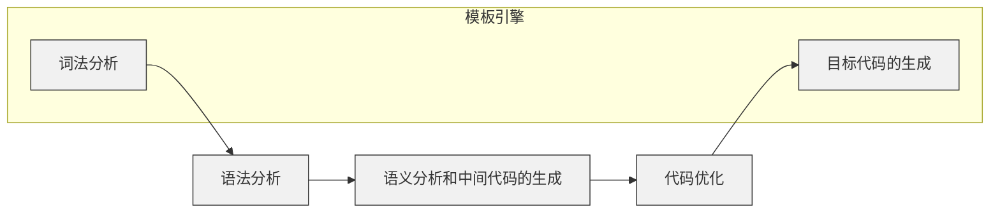

<center>图 3.7：编译的五个步骤</center>

## 4.4 模板引擎使用示例

### 4.4.1 静态博客生成器

#### 4.4.1.1 静态博客生成器概述

静态博客生成器是应用非常广泛的建站工具，许多官网的技术文档都使用静态博客生成器构建。

比较著名的静态博客生成器有 Hexo，GItBooks，VuePress 等，它们会读取特定文件夹下面的 Markdown 文件，结合和预先定义好的模板，利用模板引擎生成 HTML、CSS 和 JavaScript 文件。用户可以将生成的文件部署到服务器上，这样他人就能直接访问。

这里有必要解释什么是 Markdown 文件，Markdown 是一种轻量级标记语言，它发明的目的是让人更沉浸式地写作。传统的排版工具，比如 Word，为了实现标题、粗体、斜体和删除线等排版效果，需要比较复杂的操作步骤。而 Markdown 则只需要给文字添加特定标记，就可以实现主要的排版效果。比如 `# 标题` 实现一级标题，`**粗体**`实现粗体，`*斜体*` 实现斜体，`~~删除线~~` 实现删除线效果等。

这些市面上比较著名的静态博客生成器，生成的基本都是单页应用。所谓单页应用，是指只有一个 HTML 文件，当 URL 改变（切换页面）时，由 JavaScript 把旧的页面内容，替换为新的页面内容。优点是切换页面时速度更加快捷，缺点则是首次访问单页应用时加载速度变慢，并且由于搜索引擎只识别 HTML，而不识别 JavaScript 代码，因此单页应用的搜索排名普遍较低。

#### 4.4.1.2 静态博客生成器实现原理

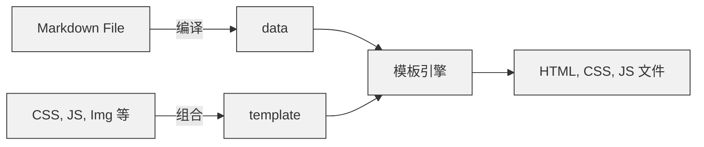

<center>图 3.8：静态博客生成器原理</center>

和 3.3.1 节类似，静态博客最终也是 data 和 template 结合生成代码。所不同的是，静态博客生成器可以认为有两个核心。第一个核心是 Markdown File 编译得到 data，第二个核心是 data 和 template 的组合。第二个核心我们在模板引擎的原理中已经解释过。所以我们着重解释第一个核心：

这个核心的工作，是将 Markdown 编译得到 data，以提供给下一个阶段。

Markdown 和 data 遵循特定的映射关系：

- Markdown 的 `#` 对应 HTML 的 `h1` 标签，`##` 对应 `h2` 标签，以此类推，直到 `h6` 标签
- Markdown 的 `---` 对应 HTML 的 `hr` 标签
- Markdown 的 `[Link](http://a.com)` 对应 HTML 的 `<a href="http://a.com" />`
- 更多可以参考 https://commonmark.org/help/

Markdown 编译得到 HTML 代码片段的这部分工作，有很多开源库可以使用，比如：

- markdown-it：https://github.com/markdown-it/markdown-it
- markedjs：https://github.com/markedjs/marked

#### 4.4.1.3 自编写的静态博客生成器

我们使用模板引擎 art-template 编写了一个静态博客生成器，它的源代码在  https://github.com/lijunlin2022/blog，生成的效果可以到 http://blog.lijunlin.xyz 上查看。


<center>图 3.9：静态博客生成器生成的博客效果</center>

不同于市面上常见的静态博客生成器，我们编写的静态博客生成器，生成的是多页应用。顾名思义，多页应用就是有多个 HTML 页面的应用。实质上是将每一个 Markdown 文件都编译为一个 HTML 文件。

此静态博客生成器主要分为两部分：

- 当你运行 `npm run dev` 命令时，会开启开发服务器，在此你可以预览生成的 HTML 效果。
- 当你运行 `npm run build` 命令时，会读取 post 目录下的所有 Markdown 文件，生成 HTML 文件并放置在 dist 目录下。

它最核心的两部分代码如下所示：

- 组合模板和数据的代码

```js
// ...
const generateHtml = (dirPath) => {
  // 根据路径读取文件, 返回文件列表
  const names = readdirSync(dirPath)
  for (let i = 0; i < names.length; i++) {
    const itemPath = path.join(dirPath, names[i])
    // 是文件
    if (statSync(itemPath).isFile()) {
	  // ...
      // Markdown 生成的 HTML 片段
      const htmlContent = md.render(readFileSync(itemPath, 'utf-8'))
      // 模板文件
      const templateContent = readFileSync(...)
      // 组合 HTML 片段和模板文件                                    
      const generation = template.render(templateContent, {
        htmlContent
      })
      // 输出文件
      writeFileSync(newItemPath, generation, 'utf-8')
      return
    }
    // 是文件夹，递归
    generateHtml(itemPath)
  }
}
// ...
```

- 模板代码

```html
<!DOCTYPE html>
<html lang="en">
<head>
  <meta charset="UTF-8">
  <meta http-equiv="X-UA-Compatible" content="IE=edge">
  <meta name="viewport" content="width=device-width, initial-scale=1.0">
  <title>博客</title>
  <!-- css 代码 -->
  <!-- ... -->
</head>
<body>
  <article class="markdown-body">
    <!-- 要替换的数据 -->
    {{@htmlContent}}
  </article>
  <!-- js 代码 -->
  <!-- ... -->
</body>
</html>
```

### 4.4.2 拖拽组件生成 HTML 的可视化编辑器

#### 4.4.2.1 可视化编辑器概述

所谓可视化编程，是指图形化操作、图形化显示结果的编程方式。可视化编程的目的是希望借助图形化提高生产效率，并降低编程的门槛。

这种想法有先例可依，比如操作系统的操作方式，从全部是命令行的 DOS 系统，演变为全部是图形操作的 Windows 系统，显著提高了工作效率，且让普通人能更简单地使用电脑。

但可视化编程的效率，一直是一个颇具争议的问题。一部分人认为图形化的编程，能够让程序逻辑更加清晰，提高编程的效率；另一部分人则认为，图形化的编程，反而会让程序逻辑混乱不堪，降低编程效率。

究其原因，可以认为效率和程序逻辑呈如下关系：编程效率先随着程序逻辑复杂程度增加，到达临界点后编程效率便开始逐渐降低。


<center>图 3.10：可视化编程的效率和程序逻辑复杂度</center>

关键点在于临界点。如果可视化编辑器的组件封装度很高，并且预先设立合适的参考案例，那么程序逻辑复杂度增长速度一般比较缓慢，不会到达临界点。举例来说，现在商用的海报编辑器、微信公众号文章排版器，就因为方便快捷而受到欢迎。而如果组件封装度很低，那么程序逻辑复杂度便会爆炸性增长，很快便到达了临界点，因此使用人员很快便会感受到可视化编辑器非常难用。

一般的可视化编辑器至少分为两部分：组件区域（物料区域）和预览区域。

- 组件区域的功能是，展示预先封装的组件，以备使用者选择。
- 预览区域的功能是，展示将生成的代码实际效果，如果使用者不满意效果，则可以加以调整。

下面两张图分别是 WIDE1.0 和 WIDE2.0 的操作平台。

WIDE 1.0 中，左侧是组件区域，右侧是预览区域。组件区域有 5 种元素：布局子系统、基础元素、静态元素、常用元素和收藏元素。当开始编辑程序时，可以从左边的预览区域拖拽任意一种元素到右侧的编辑区域，然后再编辑细节。


<center>图 3.11：WIDE 1.0 的组件区域和预览区域</center>

而在 WIDE 2.0 中，左侧是预览区域，右侧是组件区域。相比 WIDE 1.0 来说，组件区域的元素种类更多更丰富。


<center>图 3.12 WIDE2.0 的组件区域和预览区域</center>

#### 4.4.2.2 可视化编辑器实现原理

实现可视化编辑器有多种方法，在这里我们比较简单的方法。我们用这个方法实现了自编写的可视化编辑器，你可以到 3.4.2.3 查看它的具体描述。

为解答如何实现可视化编辑器，我们将可视化编辑器的实现方法拆分为四个具体的问题。

- 如何拖拽侧边栏的组件？
- 将组件拖拽到预览区域后，如何确定预览区域中组件的位置？
- 如何改变组件的样式？
- 如何导出生成的 HTML？

**如何拖拽侧边栏左侧的组件？**

HTML5 中，有着控制 HTML 元素拖拽的 API。我们可以将 HTML 元素的 draggable 设置为 true，此时 HTML 元素便具备了可拖拽的性质。


<center>图 3.13：HTML 元素的拖拽和放置</center>

我们以一个图片来讲解拖拽相关的事件 API。图中是一个可以拖拽的组件，正从左往右经过可以放置组件的区域。

- 拖拽开始时，会触发组件的 dragstart 事件。
- 组件进入区域时，会触发区域的 dragenter 事件。
- 组件和区域重合时，每隔几百毫秒便触发区域的 dragover 事件，如果选择放置组件，会触发区域的 drop 事件。
- 组件离开区域时，会触发区域的 dragleave 事件。

我们可以使用 addEventListener 来监听事件，当事件被触发之后，再执行特定的函数。addEventListener 的语法如下所示：

```js
target.addEventListener(type, listenner)
```

- `type`：事件的名称，也就是之前提到的事件 API 的名称，比如 `dragstart`，`dragleave` 等
- `listener`：监听到事件后，可以执行的回调函数。

举例如下：

```html
<button draggable="true" id="btn">可以拖拽的按钮</button>
<script>
const btn = document.getElementById('btn')
btn.addEventListener('dragstart', function (e) {
  console.log(e)
  console.log('123456')
})
</script>
```

当按钮被拖拽后，会打印事件 e 和 1223456，而在事件 e 中其实包含着位置的坐标属性 offsetX，offsetY，clientX，clientY，以及 screenX 和 screenY。这里有必要解释这些坐标属性，因为之后在确定预览区域位置时会用到。


<center>图 3.14：clientX，clientY，offsetX，offsetY 和 screenX，screenY</center>

- offsetX 和 offsetY 的值是点击位置和鼠标点击元素的上边距、左边距
- clientX 和 clientY 是点击位置和浏览器可视区域的上边距、左边距
- screenX 和 screenY 是点击位置和显示屏的上边距、左边距

**将组件拖拽到预览区域后，如何确定预览区域中组件的位置？**


<center>图 3.15：确定预览区域中组件的位置</center>

如图所示，如果想要定位组件的位置，我们可以将组件的 position 设置为 absolute。可以将区域的区域的 position 设置为 relative。这样实质上形成了一个坐标系，区域左侧顶点坐标可以认为是 (0, 0)，而组件左侧顶点坐标则是 (top, left)。

当组件被拖拽移动后，我们可以实时计算组件和区域的位置关系。至于计算关系，则是通过我们组件的 clientX，clientY 等属性和区域的 clientX，clientY 等属性计算后，并记录到组件的 top 和 left 上，就像下方的代码。

```html
<div style="position:relative; top: 100; left: 100;"></div>
```

**如何改变组件的样式？**

通常而言，我们会使用 CSS 来改变 HTML 的样式，而 CSS 可以以内联样式结合 HTML。

所谓内联样式，是指将 CSS 代码写在 HTML 的 style 属性内部。

比如我们想要生成如下的效果。

<div style="width:200px;height:100px;background-color:red;color:yellow;text-align:center;line-height: 100px;">这是一个方块</div>

<center>图 3.16：HTML 的行内样式</center>

它的源代码如下：

```html
<div style="width:200px;height:100px;background-color:red;color:yellow;text-align:center;line-height: 100px;">
  这是一个方块
</div>
```

**如何导出生成的 HTML?**

当内容被渲染到预览区域后，浏览器其实已经生成了对应的 HTML 元素，我们可以直接获取生成的 HTML。

比如一个 id 为 square 的 HTML 元素，我们可以通过如下代码获取 HTML 元素的 data。

```js
const square = document.getElementById('square')
const data = square.outerHTML
```

接下来，便可以将 data 配合预先准备好的模板引擎，生成真正的 HTML 代码。

#### 4.4.2.3 自编写的可视化编辑器

我们用 Vue 实现了可视化的编辑器，你可以到 https://github.com/lijunlin2022/rainforest-low-code 上查看源代码，至于这个可视化编辑器，我们部署到了如下网址：http://lowcode.lijunlin.xyz。它的效果如下所示：


<center>图 3.17 自编写的可视化编辑器效果</center>

如图所示，我们自编写的可视化编辑器分为四个部分，左侧的组件区域，正中的预览区域，正上方的导出区域，右侧的样式编辑区域。

- 在左侧组件区域可以看到可以选择的 HTML 标签，它们分别是普通文本标签 span，一级标题标签 h1 到六级标题标签 h6，按钮标签 button 和输入框标签 input。
- 正中的预览区域可以预览生成的 HTML 效果。图片中的《早发白帝城》一诗，便是拖拽后生成的 HTML 效果。
- 正上方的导出区域，如果点击导出 HTML 按钮可以将预览到的 HTML 结合模板导出，点击导出 JSON 则导出由 HTML 代码中属性组成的 JSON 文件。
- 右侧的样式编辑区域的作用是，如果我们在预览区域选中组件后，可以改变它的文本颜色和标签颜色，还有文本内容。

总结来看，我们编写的可视化编辑器，虽然十分简陋，但已经实现了基本的可视化编辑器的效果。

# 5 持续集成和持续部署的自动化

## 5.1 本章内容组织

本章探讨的主要问题是，当通过模板技术生成软件代码后，如何将软件代码集成和部署，以供他人使用。

本章内容安排如下：

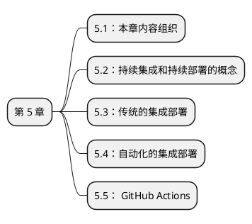

<center>图 5-1 第 5 章的内容组织</center>

## 5.2 持续集成和持续部署的概念

一般而言，软件开发往往由一个团队内的多个人开发完成，他们分别负责软件的不同部分，开发进度也各有不同。因此会使用版本管理系统管理代码，以 Git 为例，主要代码往往会在 main 分支（主分支），而不同工作人员拥有不同的 dev 分支（开发分支）。开发工作完成后，最终会将 main 分支上的代码进行构建、打包，然后放置到服务器上运行。

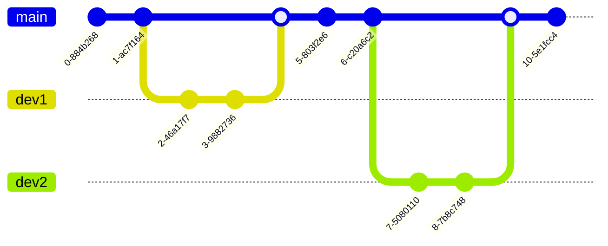

<center>图 5-1：Git 版本控制系统图</center>

然而随着开发的推进，往往会出现一些问题。比如 main 分支和 dev 分支单独时均运行正常，但是当代码合并之后，便产生了严重的错误，无法构建运行等。另外，如果 dev 分支和 main 分支长时间没有合并，dev 分支的内容便会逐渐偏离 main 分支，一旦需要合并代码并交付时，开发人员才发现出现了大量的冲突。

为了合并代码的问题，提出了持续集成（Continuous Integration，简称 CI）的概念。所谓持续集成，便是高频地将最新的代码合并到 main 分支上，其目的是保证快速开发出高质量的软件。一般持续集成会预先编写测试用例，只有经过两轮测试后代码才能成功合并到 main 分支。第一轮测试，会测试 dev 分支上的代码，通过后 dev 分支才能和 main 分支合并；第二轮测试，会测试合并了 dev 分支后main 分支的代码，通过后才能进入部署阶段。

经过持续集成后，便到了持续交付（Continuous Delivery，简称 CDV）阶段。所谓持续交付，是指高频地将可以测试的代码。交由测试人员或者用户来评审。

经过持续交付后，便到了持续部署（Continuous Deployment，简称 CD）阶段。所谓持续部署，便是将通过审计的代码部署到生产环境当中。

## 5.3 传统的集成部署


<center>图 5-3 传统的集成部署步骤</center>

传统的集成和部署模型过程如下：

- 首先，一个项目的开发任务，由项目经理将分为几部分，分别指派给不同的开发人员。
- 当开发人员完成各部分代码后，它们会各自进行单元测试，然后把各部分代码交给项目经理。
- 由项目经理手动合并代码各部分代码，然后将合并完成的代码部署到测试环境。
- 测试人员开始进行集成测试，并评审软件，验收软件是否符合需求分析文档。
- 测试人员发现 Bug，整理后反馈给项目经理。
- 项目经理分析 Bug 来源，指派 Bug 给不同的开发人员。
- 开发人员处理 Bug，处理结束后将修改好的代码交给项目经理。
- 如此循环往复，直到代码验收合格，才部署到生产环境。

这种传统的集成和部署有着严重的问题。

- 其一，人力成本高。每一个步骤都需要人与人之间相互沟通，当代码变更频十分频繁时，人与人的的交流也必须越来越频繁。
- 其二，产品质量无法保证。由于是人力测试，人力部署，很可能因为疏忽未能发现问题。
- 其三，开发周期难以确定。因为集成和部署都是在各部分代码完成之后才进行，所以往往会在项目后期集中发现大量未解决的问题，因而导致加班、甚至导致项目延期。

## 5.4 自动化的集成部署


<center>图 5-4：自动化的集成和部署步骤</center>

自动化的集成与部署过程如下：

- 开发人员在本地提交使用 IDE 编写代码，并自己进行单元测试。
- 当单元测试通过之后，将代码提交到远程的代码仓库。
- 一般代码仓库检测到有代码提交，就会触发 Webhooks 运行持续集成工具。所谓的 Webhooks，是一类由特定事件触发的执行的函数，通常用来通知第三方的应用。就拿代码提交触发集成工具来说，一般会由 GitHub 触发 GitHub Actions 进行持续集成，或者 GitLab 触发 Jenkins 进行持续集成。
- 由 CI 工具对代码进行编译，测试和打包。如果发生错误，则会通过 Email 或者其他联系方式主动通知开发人员，由开发人员查看并处理 Bug。如果正常通过，则会将代码发布到测试环境，交由测试人员测试。
- 测试人员审计代码时，如果发现问题，也会可以通过 Email 或其他联系方式通知开发人员。
- 如果循环往复，直到代码的审计完成。

这些过程中，由开发人员参与的步骤只有编码和单元测试，由测试人员主动参与的步骤只有代码审计。其余部分全部交给自动化的脚本执行。

## 5.5 GitHub Actions

通常来说，最为常见的持续集成和持续部署工具是 Jenkins，它是由 Java 编写，开源免费的持续集成和持续部署工具。然而 Jenkins 的配置过程相对复杂，完全介绍的化会使我们的论文显得臃肿。

因此我们选择利用更轻量级的 CI/CD 工具进行实际流程的演示，也就是 GitHub Actions。

GitHub Actions 是 GitHub 在 2018 年推出了一款轻量的持续集成持续部署服务。

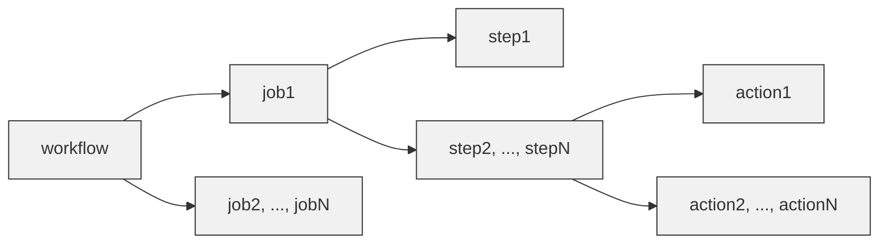

<center>图 5-5：GitHub Actions 的相关概念</center>

为更清晰地了解 GitHub Actions，下面介绍 GitHub Actions 的一些基本概念。

workflow，是指一次持续集成和持续部署的过程，一般一个 yml 脚本文件对应一个 workflow。而一个 workflow 由多个 step 组成，一个 step 由 多个 action 组成。action，则是指执行一个或者多个命令。

在 3.4.2.2 中一节中，我们介绍了自己实现的 HTML 可视化编辑器。此 HTML 可视化编辑器，我们正是使用了 GitHub Actions 将其部署到了腾讯云的服务器中。

项目的目录结构如下所示，其中最需要注意的 .github/workflows 文件下的 deploy.yml 文件。它就是控制持续集成和持续部署的文件。

```
|--.github
|	|--workflows
|		|--deploy.yml
|--public
|--src
|--.gitingore
|--package.json
|--。。。
```

yml 文件是一种配置文件，它的表示方法非常简洁，冒号左侧是键，冒号右侧是一个空格和键对应的值，下面是 deploy.yml 文件的详细内容。每当代码提交后，因为我们只有一个 deploy.yml 文件，因此只会执行一次持续集成和持续部署的工作流。

```yml
name: 上传腾讯云
on:
    push:
        branches:
            - main
jobs:
    build:
        runs-on: ubuntu-latest
        steps:
            - name: 迁出代码
              uses: actions/checkout@main
            - name: 安装 node.js
              uses: actions/setup-node@v1
              with:
                  node-version: 14.0.0
            - name: 安装依赖
              run: npm install
            - name: 打包
              run: npm run build
            - name: 发布到腾讯云
              uses: easingthemes/ssh-deploy@v2.1.1
              env:
                  SSH_PRIVATE_KEY: ${{ secrets.PRIVATE_KEY }}
                  SOURCE: 'dist'
                  REMOTE_HOST: ${{ secrets.REMOTE_HOST }}
                  REMOTE_USER: 'root'
                  TARGET: '/www/wwwroot/lowcode'
```


<center>图 5-6：GitHub Actions 一次成功运行的过程</center>

上图显示了一次成功利用 GitHub Actions 将代码部署到服务器的过程。这次工作流中只有一个任务 build。而这个任务又有 5 个步骤组成，分别是：迁出代码，安装 Node.js，安装依赖，打包代码，并把打包好的代码发布到腾讯云服务器上。

# 6 结论与展望

现在总结我们《自动软件生成系统的研究与实践》课题的研究中研究成果，以及对未来的展望。

（1）我们提出了一种生成代码的新思路，把需要完成的任务作为目标，首先由 Prolog 引擎推理实现目标，在此过程中记录实现目标的最佳步骤；之后我们通过模板技术”记忆“最佳步骤生成代码；最后把生成的代码通过 CI/CD 技术进行部署。

（2）我们查阅相关文献，了解国内外代码生成方法的相关研究，Prolog 的相关研究，模板技术的研究和 CI/CD 技术的相关研究。

（3）我们使用低代码平台 WIDE，生成了一个典型的学生信息管理系统，部署在部署在 http://wide.lijunlin.xyz。

（4）我们研究 Prolog 同关系数据库的关系，并使用 JavaScript 模拟 Prolog 推理过程。得到一些重要结论。第一：固定功能的软件系统可以视为一种特殊的软件系统；第二：Prolog 的推理过程是深度优先算法的执行过程；第三：根据 Prolog 的推理过程，可以得到实现目标的最佳步骤。

（5）我们研究了如何利用模板技术结合数据生成代码。如果能获取 Prolog 推理的最佳步骤的数据，便能通过模板技术生成代码。在此章节中，我们自己实现了简易的模板引擎，部署在 http://template-engine.lijunlin.xyz。我们还使用模板引擎实现了两个比较普遍的软件系统。第一个是读取 Markdown 生成 HTML 的静态博客生成器，部署在 http://blog.lijunlin.xyz；第二个是可以拖拽组件生成 HTML 的可视化编辑器，部署在 http://lowcode.lijunlin.xyz。

（6）我们研究了持续集成和持续发布的原理。如果模板技术能成功生成代码，便可以使用 CI/CD 技术加以部署，交给用户使用。

但我们的课题研究还有一些不足需要完善。其中一个不足是从 Prolog 引擎推理到模板技术的衔接。虽然我们推断得出 Prolog 引擎再经过一次推理后，能够得到解决问题的最优步骤。但最优步骤的数据应该如何定义，这个数据又是如何结合模板技术的尚没有解决。

如果再今后的研究中，能够将这一过程完善，那么整个软件自动生成的过程便会更加简明清晰。

# 参考文献

[1] 陈增荣. 软件开发方法述评. AKA 杂志. [2012-05-22]

[2] 管太阳. 基于模板的自动代码生成技术的研究[D].电子科技大学,2007.

[3] Forrester. New Development Platforms Emerge For Customer Facing Applications[EB/OL]. [June 9th, 2014]. https://www.forrester.com/report/New-Development-Platforms-Emerge-For-CustomerFacing-Applications/RES113411.

[4] 石菲.低代码开发占领新常态市场[J].中国信息化,2021(02):11.

[5] 王正敏,张太红,李永可,白涛.FreeMarker模板引擎在线动态生成Excel和Word文档技术[J].计算机与现代化,2016(04):109-113.

[6] 徐杰.PHP编译型模板的设计与实现[J].信息系统工程,2012(04):38-39+34.

[7] 倪朋朋,郑丽丽,顾海全,王越.基于模型的汽车室内灯控制系统设计及应用[J].中国照明电器,2020(11):47-51.

[8] 徐龙杰,万建成.基于模型的用户界面代码自动生成[J].计算机工程与应用,2004(12):112-115+192.

[9] 王黎明,王帼钕,周明媛,褚艳利,陈科,陈平.程序流程图到代码的自动生成算法[J].西安电子科技大学学报,2012,39(06):70-77.

[10] 王学斌,吴泉源,史殿习.模型驱动架构中的模型转换方法[J].计算机工程与科学,2006(11):133-135+139.

[11] 李佳锦. 基于UML的Java代码自动生成器的研究与实现[D].华北电力大学,2020.DOI:10.27139/d.cnki.ghbdu.2020.000436.

[12] 李德兵,尹战文,王洪明.Java EE基于Hibernate的ORM框架[J].电子技术,2010,37(02):7-8+3.

[13] 袁冠远,罗林,杜剑.PHP平台开源ORM库Doctrine的应用[J].软件导刊,2014,13(02):102-104.

[14] 牛牧,钟馥遥.使用Hash Map实现简单ORM[J].电脑开发与应用,2007(12):35-36+39.

[15] 赖朝安,孙延明,郑时雄.结合C++与Prolog语言快速开发专家系统[J].计算机工程与应用,2002(03):30-32.

[16] 邱鹏瑞,杨波,张丽华.基于Prolog与Java的教学评价专家系统设计[J].红河学院学报,2012,10(02):57-59.DOI:10.13963/j.cnki.hhuxb.2012.02.047.

[17] 刘自伟,叶红兵. 从数据库生成PROLOG知识库[C]//.第十届全国数据库学术会议论文集.,1992:160-161.

[18] 李磊,左万历,李希春.PROLOG—DBMS系统实现中的子句间优化技术[J].软件学报,1995(03):136-142.

[19] 姬一文,吴庆波,杨沙洲.一种服务器端模板引擎的改进与实现[J].计算机应用研究,2011,28(03):1077-1079+1087.

[20] 刘佳,卢显良.小型高效模板引擎的设计与实现[J].计算机应用研究,2006(04):222-224.

[21] 陈开宇. 编译型模板引擎设计与实现[D].电子科技大学,2012.

[22] 刘倍雄,臧艳辉.基于PHP安全模板引擎的设计与实现[J].电子世界,2014(12):420-421.

[23] 刘烈毅. 基于jQuery框架的前端模板引擎的研究与实现[D].西安电子科技大学,2015.

[24] Bogdan Vasilescu, Yue Yu, Huaimin Wang, Premkumar Devanbu, and Vladimir Filkov. 2015. Quality and productivity outcomes relating to continuous integration in GitHub. In <i>Proceedings of the 2015 10th Joint Meeting on Foundations of Software Engineering</i> (<i>ESEC/FSE 2015</i>). Association for Computing Machinery, New York, NY, USA, 805–816. https://doi.org/10.1145/2786805.2786850

[25] S. Mysari and V. Bejgam, "Continuous Integration and Continuous Deployment Pipeline Automation Using Jenkins Ansible," 2020 International Conference on Emerging Trends in Information Technology and Engineering (ic-ETITE), 2020, pp. 1-4, doi: 10.1109/ic-ETITE47903.2020.239.

[26] M. Meyer, "Continuous Integration and Its Tools," in IEEE Software, vol. 31, no. 3, pp. 14-16, May-June 2014, doi: 10.1109/MS.2014.58.

[27] M. Hilton, T. Tunnell, K. Huang, D. Marinov and D. Dig, "Usage, costs, and benefits of continuous integration in open-source projects," 2016 31st IEEE/ACM International Conference on Automated Software Engineering (ASE), 2016, pp. 426-437.

[28]丁世飞. 人工智能[M]. 第 2 版. 清华大学出版社, 2015.

[29] 屈婉玲, 耿素云, 张立昂. 离散数学[M]. 第 2 版. 北京:高等教育出版社, 2015.

[30] Wikipedia. MVC[EB/OL]. [April 14, 2022]. https://zh.m.wikipedia.org/zh-cn/MVC.

# 致谢

不知不觉间，四年的大学已经接近尾声，毕业设计也将近结束。

在这里，首先要感谢我的毕业设计导师孙建伟。孙老师在了解低代码平台 WIDE，特地设置了《自动软件生成系统的研究与实践》这个课题。此课题涉及的知识点繁多复杂，孙老师却能够认可我的能力，并指导我研究此课题，让我感到非常荣幸。在课题的 Prolog 原理部分，我曾经陷入瓶颈。孙老师和我详细讨论后，指导我学习一阶谓词逻辑相关知识，并指明了以亲属树为例子研究 Prolog 的推理的路径，我因此得以突破难点。

然后要感谢美团闪购团队的许鑫老师和士林老师，他们有着多年 Web 开发经验。在课题的代码生成部分，我实现模板引擎、静态博客生成器和可视化 HTML 编辑器的关键部分，他们都曾给予我点拨。感谢他们的指导和鼓励。

接着要感谢我的两位大学好友，王梓丞同学和阿希达同学。王梓丞同学试用了我的可视化编辑器，并给出使用 JSON Schema 加以优化的建议。阿希达同学则是自开题以后，和我互相督促，一起完成毕业设计和论文。

最后要感谢大学的其他老师和同学，因为老师的辛勤教导，各位同学的互帮互助，我才能学习到丰富的知识，度过丰富的大学生活。
