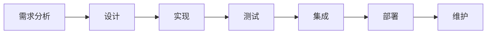
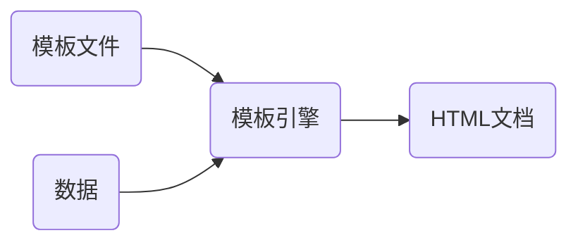
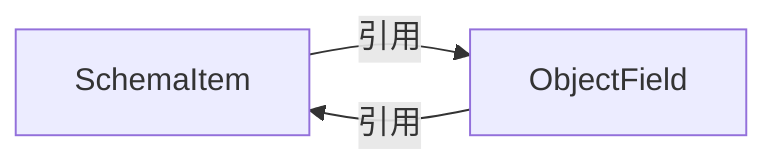
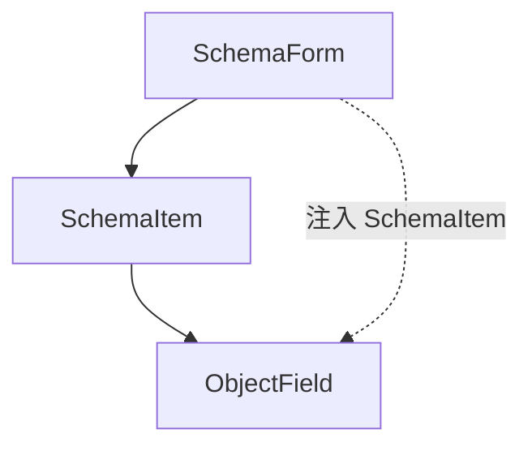
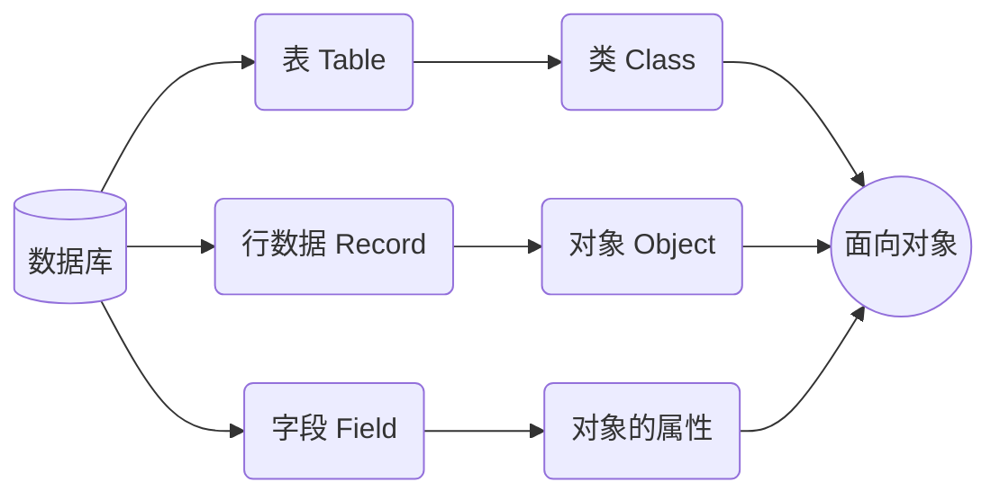
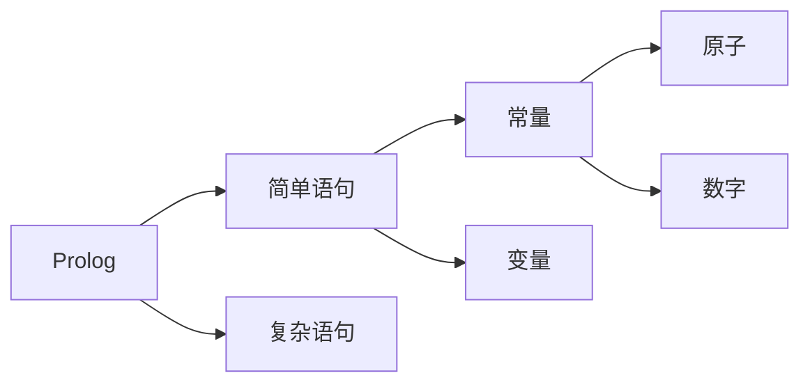

# 自动软件生成系统的研究与实践

<center>姓名：李俊霖；学号：1120180326</center>

<center>北京理工大学计算机学院</center>

**摘要**：软件自诞生那天起，最少手工编程、快速开发和交付一直是开发者追求的目标。本文探究了目前业界的自动软件生成系统平台（低代码平台）的自动开发、测试、部署、维护等方案。在开发中，介绍了模板引擎和 JSON Schema 配合生成前端代码的方法，以及 BPMN 和 ORM 配合生成后端代码的方法。并介绍 Jest 测试，GitHub Actions，GitLab +  Jenkins 部署。在探究理论过程中，给出作者使用 Vue 编写的三个例子：使用模板引擎生成静态博客、拖拽生成 HTML，使用 JSON Schema 配置生成表单。在实践部分，使用业界的自动软件生成工具 WIDE，生成了一个典型的学生信息管理系统。

**关键词**：低代码（Low Code），业务流程建模符号（BPMN），模板引擎，JSON Schema，BPMN，ORM，Jest，GitHub Actions，GitLab，Jenkins，Vue，WIDE

# 目录

[toc]

# 1 绪论

## 1.1 选题的定义、来源、涉及知识点

### 1.1.1 选题定义

2014 年，弗雷斯特研究机构（Forrester  Research）上发布了一篇名为 《面向用户的应用程序出现了新的发布平台存储》（New Development Platforms Emerge For Customer Facing Applications）的报告。

报告中提到了一种==能够**快速交付**业务应用程序的平台，它只需要最小的手工编程，并且在**设置、培训**和**开发**方面投资最少==。

> Platforms that enable **rapid delivery** of business applications with **minimum hand-coding** and minimal upfront investment in **setup, training**, and **development**
>
> ——[New Development Platforms Emerge For Customer Facing Applications| Forrester](https://www.forrester.com/report/New-Development-Platforms-Emerge-For-CustomerFacing-Applications/RES113411)

区别于过去的单一功能，这种平台的目的是生成业务应用程序，他们将这种平台称之为（Low Code）。

这种平台也正是作者课题中所说的，**自动软件生成系统**。

### 1.1.2 选题来源

事实上，从软件整个行业诞生以来，快速生成项目应用、最小手动编程的诉求一直存在。为此行业内进行了不同的尝试。

比如可视化编程语言，1991 年由微软公司推出的 Visual Basic 语言。采用面向对象的思想，开发人员可以使用 Visual Basic 的工具箱直接拖拽得到窗口、菜单等对象，然后再在对象的基础上进行编码。

再比如网页设计工具，1997 年由 Adobe 公司发布的 Dreamweaver，提供了直接拖拽元素，生成网页代码的功能。

又比如 1999 年由 Sun 公司主导创建的 JSP，把 Java 代码嵌入到 HTML 页面中，动态生成网页内容。

这些尝试，为自动软件生成系统，积累了大量的成功经验。

从 2014 年低代码概念的提出，到 2018 年开始，海内外市场开始在低代码上大量投资、研究，如今已经涌现了一批自动生成软件的平台，涉及的知识面深刻且广泛。

2022 年，作者通过导师接触到一款支持前端页面设计、服务端代码自动生成，自动完成数据库设计等功能的集成开发工具——WIDE（Web Integrated Development Environment）。通过这款工具开发了一款典型的管理系统。

在导师指导下，作者开始对自动软件生成系统的原理做了一系列的研究与整合，根绝这些原理，作者编写了一些项目。

这些成果汇总之后，便是如今的选题——自动软件生成系统的研究与实践。

### 1.1.3 选题涉及知识点

以经典的瀑布模型来看，软件开发工作一般会依次经历以下环节：



一个自动软件生成系统，代表着这些步骤中，基本能够自动完成。我们也将涉及**除了需求分析、设计之外的所有步骤**。

- 实现部分，分为前端代码自动生成和后端代码自动生成。
  - 前端代码自动生成，将介绍模板引擎（Template engine）生成代码、JSON 纲要（JSON Schema）校验数据

  - 后端代码自动生成，将介绍 BPMN 作为工作流的工具，以及对象关系映射（ORM，Object Relation Mapping）生成 SQL。

- 测试部分：介绍单元测试、集成测试和 UI 测试中自动化测试工具的引入。

- 集成和部署部分，介绍自动化的持续集成与持续发布（CI/CD）。

- 维护部分，将介绍业界当今的低代码平台是如何进行维护的。

除以上知识外，我们将会额外介绍一些辅助自动生成软件系统的工具，比如 Prolog，决策树等知识。

最后，我们将会使用一个成熟的工具，WWIDE，实现一个典型的信息管理系统。该工具集中使用了之前介绍的流程中，提到的各种各样的思想和工具。

## 1.2 论文的结构和重点

### 1.2.1 论文的结构

论文的结构安排和 1.1.3 节瀑布模型基本对应。

| 章节 | 标题                           | 主要内容                                                     | 关键词                                            |
| ---- | ------------------------------ | ------------------------------------------------------------ | ------------------------------------------------- |
| 一   | 绪论                           | 1. 选题的定义、来源和设计知识点<br/>2. 论文的结构和重点<br/>3. 国内外相关理论研究、应用实践<br/>4. 论文的创新之处 | 选题<br/>论文                                     |
| 二   | 自动软件生成系统的实现方法     | 1. MVC 模型<br/>2. 前端 View——模板引擎和 JSON Schema<br/>3. 后端 Model——BPMN 和 ORM<br/> | MVC<br/>模板引擎<br/>ORM<br/>BPMN<br/>JSON Schema |
| 三   | 自动化测试                     | 1. 测试的类型和方法<br/>2. 常见测试工具                      | Jest                                              |
| 四   | 自动化集成和部署               | 1. 自动化集成和部署的来源<br/>2. GitHub Actions 的使用<br/>3. GitLab 和  Jenkins | GitHub Actions<br/>GitLab<br/>Jenkins             |
| 五   | 自动软件生成系统的维护         | 1. 常见的维护方法<br/>                                       |                                                   |
| 六   | 自动软件生成系统的其他辅助工具 | 1. Prolog                                                    | Prolog                                            |
| 七   | 实践——WIDE 实现典型管理系统    | 1. WWIDE 的基础概念<br/>2. 前端设计<br/>3. 后端设计<br/>4. 发布 |                                                   |
| 八   | 参考文献                       |                                                              |                                                   |

其中，二到六章是理论研究部分，第七章是实践部分。

### 1.2.2 论文的重点

由于选题介绍了从设计到维护的所有步骤中，和自动化有关的众多概念，因此必须有所取舍。

在论文中，分别有理论研究和工程实践两个重点。

- 理论研究的重点是：第三章《自动软件生成系统的实现方法》

  此部分我们将着重介绍前端代码生成的两种关键技术，并给出应用这些技术实现的应用，包括：

  - 模板引擎（Template Engine）
    - 实现一个通过 Markdown 生成 HTML 的博客
    - 实现一个拖过拖拽生成 HTML 的编辑器
  - JSON Schema，实现一个通过 JSON 配置生成 HTML 表单的应用

  至于后端代码生成，我们将会介绍 BPMN 工作流和 ORM

- 实践部分的重点是：第八章《WWIDE 实现管理系统》

  此部分我们将使用 WIDE 生成一个学生信息管理系统

## 1.3 国内外相关理论研究、应用实践

### 1.3.1 理论研究

### 1.3.2 应用实践

简要国内自动软件生成系统一览：

<table>
  <tr>
    <th>名称</th>
    <th>企业</th>
    <th>链接</th>
  </tr>
  <tr>
    <td>宜搭</td>
    <td rowspan="2">阿里</td>
    <td><a href="https://www.aliwork.com/">https://www.aliwork.com/</a></td>
  </tr>
  <tr>
    <td>imgCook</td>
    <td><a href="https://www.imgcook.com/">https://www.imgcook.com/</a></td>
  </tr>
  <tr>
    <td>腾讯云微搭</td>
    <td>腾讯</td>
    <td><a href="https://cloud.tencent.com/product/weda"> https://cloud.tencent.com/product/weda</a></td>
  </tr>
  <tr>
    <td>简道云</td>
    <td>帆软软件有限公司</td>
    <td><a href="https://www.jiandaoyun.com/">https://www.jiandaoyun.com/</a></td>
  </tr>
  <tr>
    <td>奥哲·氚云</td>
    <td>深圳奥哲网络科技有限公司</td>
    <td><a href="https://h3yun.com/#/home">https://h3yun.com/#/home</a></td>
  </tr>
  <tr>
    <td>易鲸云</td>
    <td>北京炎黄盈动科技发展有限公司</td>
    <td><a href="https://www.actionsoft.com.cn/">https://www.actionsoft.com.cn/</a></td>
  </tr>
  <tr>
    <td>明道云</td>
    <td>上海万企明软件有限公司</td>
    <td><a href="https://www.mingdao.com/">https://www.mingdao.com/</a></td>
  </tr>
  <tr>
    <td>IVX</td>
    <td>深圳市世云新媒体有限公司</td>
    <td><a href="https://www.ivx.cn/">https://www.ivx.cn/</a></td>
  </tr>
  <tr>
    <td>amis</td>
    <td>百度</td>
    <td><a href="https://aisuda.bce.baidu.com/amis/zh-CN/docs/index">https://aisuda.bce.baidu.com/amis/zh-CN/docs/index</a></td>
  </tr>
</table>

简要国外自动软件生成系统：

<table>
  <tr>
    <th>名称</th>
    <th>企业</th>
    <th>链接</th>
  </tr>
  <tr>
    <td>Power Apps</td>
    <td>Microsoft</td>
    <td><a href="https://powerapps.microsoft.com/en-us/">https://aisuda.bce.baidu.com/amis/zh-CN/docs/index</a></td>
  </tr>
  <tr>
    <td>OuterSystems</td>
    <td>OuterSystems</td>
    <td><a href="https://www.outsystems.com/">https://www.outsystems.com/</a></td>
  </tr>
</table>

## 1.3 论文的研究目的、内容及方法

本论文目的在对当前业界自动化代码的方式的原理做一个整合，采取的方法为理论研究 + 工程实践。

## 1.4 论文的创新之处

# 2 自动化编程实现

## 2.1 自动化编程的核心模型——MVC 模型

在经典的应用软件中，一般都遵从 MVC 模式（Model View Controller）。

- `Model` 指业务模型，它一般有着最多的处理任务，负责数据的增删改查
- `View` 指用户界面，它负责展示处理过后的数据
- `Controller` 指控制器，它本身不输出任何东西，也不做任何的处理，它知识接受请求并决定调用哪一个 Model 去处理请求

自动化编程的核心实现，则在于 View 的自动化以及 Model 的自动化，为此我们需要介绍两个关键技术，模板引擎（Template Engine）和对象关系映射（Object Relation Mapping），以及为了限制它们格式请求的一种规范，JSON Schema。

## 2.2 View 的自动化实现——模板引擎和 JSON Schema

### 2.2.1 模板引擎

#### 2.2.1.1 实现原理

模板引擎，是为了使用户界面与业务数据（内容）分离而产生的。

通过模板引擎组合模板与数据，就能够生成 HTML 文档。



模板引擎分为很多种，最基础的模板引擎称为`置换型模板引擎`，它的作用是将特定的标记替换为写好的数据。

比如，在模板中有这样一段代码：

```js
const template = '<p>Hello, my name is <%name%></p>'
```

给出的数据如下：

```js
const data = { name: 'Tom' }
```

在实际渲染时，要将 template 中的 `name` 将会被替换，得到

```js
'<p>Hello, my name is Tom</p>'
```

不考虑性能，完全可以用一个字符串替换的方法，来实现一个最简单的模板引擎：

```js
function engine (template, data) {
  const result = template.replace(/<%([^%>]+)?%>/g, function (match, key) {
    return data[key]    
  })
  return result
}

const template = '<p>Hello, my name is <%name%></p>'
const data = { name: 'Tom' }

console.log(engine(template, data))
// 结果为: <p>Hello, my name is Tom</p>
```

然而，以上的代码仅能针对简单的对象，而对于复杂的嵌套对象，比如：

```js
const user = {
  name: 'Tom',
  institution: {
    name: 'MIT',
    address: 'United States'
  }
}
```

要在模板中被这样使用：

```js
const template = `
  <p>
  Hello, my name is <%name%>, 
  I'm from <%institution.name%> in the <%institution.address%>
  </p>
`
```

此时已经无法直接使用字符串替换来完成工作，此时一个办法就是在 `<%` 和 `%>` 直接使用 JavaScript 代码。

能完成只要的工作，是因为 JavaScript 是可以直接根据字符串来创建一个函数的，比如：

```js
const sum = new Function('a', 'b', 'return a + b')
console.log(sum(2, 6))
// 结果为: 8
```

因此单独针对一个变量，对于上述模板，我们只需要将 `<%` 和 `%>` 中央的内容当作返回值传递出来。

```js
const user = {
  name: 'Tom',
  institution: {
    name: 'MIT',
    address: 'United States'
  }
}
const fn = new Function('obj', 'return obj.institution.address')
console.log(fn(user))
// 结果为: United States
```

现在针对这个模板，我们可以这样做

```js
const user = {
  name: 'Tom',
  institution: {
    name: 'MIT',
    address: 'United States'
  }
}
const arr = []
arr.push(`<p>Hello, my name is `)
arr.push(new Function('obj', 'return obj.name').call(user, user))
arr.push(`, I'm from `)
arr.push(new Function('obj', 'return obj.institution.name').call(user, user))
arr.push(` in the `)
arr.push(new Function('obj', 'return obj.institution.address').call(user, user))
arr.push(`</p>`)
console.log(arr.join(''))
// 结果为:
// <p>
// Hello, my name is Tom, 
// I'm from MIT in the United States
// </p>
```

为此，我们可以专门写一个 engine 函数，

```js
const template = `
  <p>
  Hello, my name is <%name%>, 
  I'm from <%institution.name%> in the <%institution.address%>
  </p>
`

const user = {
  name: 'Tom',
  institution: {
    name: 'MIT',
    address: 'United States'
  }
}

function engine (template, data) {
  const reg = /<%([^%>]+)?%>/g
  let result = ''
  let cursor = 0
  let match
  while (match = reg.exec(template)) {
    result += template.slice(cursor, match.index)	// 非 <% %> 包裹部分
    result += new Function('obj', `return obj.${match[1]}`).call(data, data)
    cursor = match.index + match[0].length
  }
  result += template.substr(cursor, template.length - cursor)
  return result
}

console.log(engine(template, user))
// 结果为: 
// <p>
// Hello, my name is Tom, 
// I'm from MIT in the United States
// </p>
```

还有更多的东西，比如在模板引擎中，出现了 for 语句或者 if 语句等等

#### 2.2.1.2 分类

基本每一个可以写 Web 应用的语言，都有着自己的模板引擎。比如：

Java 的 jsp，thymeleaf，freemarker，我们这里主要介绍 JavaScript 的模板引擎

| 名称                | 出品公司 |
| ------------------- | -------- |
| nunjucks            | mozilla  |
| ejs                 |          |
| pug（原名 Jade）    |          |
| mustache            |          |
| handlebars          |          |
| art-template        |          |
| lodash template     |          |
| ES6 template string |          |

#### 2.2.1.3 实例一——静态博客

一个一直存在的，但是很容易被忽略的例子，就是静态博客框架。

比如你可以访问我在网页上的这篇博客，就是我通过自己实现的自动生成博客的代码生成的。

目前这类框架也有很多，比如：

- Hexo
- VuePress
- Hugo
- Jekyll
- GitBook
- Dosify
- Nuxt

等，这些细节各有不同，但我们只选取重要的公用部分，来解释以下它们是如何利用模板引擎来自动生成代码的。

首先我们要区分，在生成静态博客的过程中，模板和数据，分别是什么。

以我自己实现的自动化静态博客为例，每当我新编写一篇文章，运行打包命令后，会相应地生成这篇文章的 html 版本。

模板，就是公用的，基本不会改变的 html 文件，比如目前的博客，公用的模板文件为：

```html
<!DOCTYPE html>
<html lang="en">
<head>
  <meta charset="UTF-8">
  <meta http-equiv="X-UA-Compatible" content="IE=edge">
  <meta name="viewport" content="width=device-width, initial-scale=1.0">
  <title>博客</title>
  <link rel="stylesheet" href="/static/github-markdown.css">
  <link rel="stylesheet" href="/static/github.css">
  <style>
  .markdown-body {
    box-sizing: border-box;
    min-width: 200px;
    max-width: 980px;
    margin: 0 auto;
    padding: 45px;
  }
  
  @media (max-width: 767px) {
    .markdown-body {
    padding: 15px;
    }
  }
  </style>
  <script src="https://cdn.jsdelivr.net/npm/mermaid/dist/mermaid.min.js"></script>
  <script>mermaid.initialize({startOnLoad:true});</script>
</head>
<body>
  <article class="markdown-body">
  {{@htmlContent}}
  </article>
</body>
</html>
```

这里在 article 部分，有一个 `{{@htmlContent}}`，它就是我们需要的数据。

我们的数据，是读取 markdown 文件，然后通过编译转换为 html 标签的。典型的对应关系如下：

| markdown 标签     | html 标签      |
| ----------------- | -------------- |
| `#`               | `h1`           |
| `##`              | `h2`           |
| `###`             | `h3`           |
| `####`            | `h4`           |
| `#####`           | `h5`           |
| `######`          | `h6`           |
| `-` 或 `+` 或 `*` | `ul` 或 `li`   |
| `---`             | `hr`           |
| <code>```</code> |`pre` + `code`|

在数据部分我们使用了 `markdown-it` 这个库，将 markdown 文件进行转换，生成 html 标签部分，这部分标签又被作为数据，塞到了我们的模板下面。

完成这个过程的 node.js 代码如下所示：

```js
const {
  readdirSync,
  statSync,
  writeFileSync,
  readFileSync,
  mkdirSync,
  existsSync
} = require('fs')
const path = require('path')
const process = require('process')
const template = require('art-template')
const hljs = require('highlight.js')
const md = require('markdown-it')({
  highlight: (str, lang) => {
  if (lang && hljs.getLanguage(lang)) {
    try {
    return `<pre><code class="hljs language-${lang}">` +
    hljs.highlight(str, { language: lang }).value +
    `</code></pre>`;
    } catch (__) { }
  }
  return ''
  }
})

const generateHtml = (dirPath) => {
  // 根据路径读取文件, 返回文件列表
  const names = readdirSync(dirPath)
  for (let i = 0; i < names.length; i++) {
  const itemPath = path.join(dirPath, names[i])
  // 是文件
  if (statSync(itemPath).isFile()) {
    const newDirPath = dirPath.replace('post', 'dist')
    const newItemPath = itemPath.replace('post', 'dist').replace('md', 'html')
    if (!existsSync(newDirPath)) {
    mkdirSync(newDirPath)
    }
    const mdContent = readFileSync(itemPath, 'utf-8')
    const htmlContent = md.render(mdContent)
    const templateContent = readFileSync(path.join(process.cwd(), 'static/template.html'), 'utf-8')
    const generation = template.render(templateContent, {
    htmlContent
    })
    writeFileSync(newItemPath, generation, 'utf-8')
    return
  }
  // 是文件夹
  generateHtml(itemPath)
  }
}

module.exports = () => {
  // 处理 css 和 img 等静态资源, 方法是直接拷贝一份
  const staticPath = path.join(pwd.join(process.cwd()))
  generateHtml(path.join(process.cwd(), 'post'))
  console.log('build finish')
}

```

可以看到，我们会读取 post 下的文章，然后对每一个 markdown 文件，我们都先使用 `markdown-it` 的 `render` 方法，生成了 html 标签；接着我们把这些标签，给放到 template 的 render 方法中，它会把我们之前的 `{{@htmlContent}}` 给替换掉。

至于具体的代码，可以到 GitHub 上去看完整的实现。

#### 2.2.1.4 实例二——拖拽生成 HTML

在自动化生成网页方面，有一种方式叫作可视化搭建，可以通过进行拖拽页面模块，实现过程的可视化。

其实在网页的可视化搭建，有着比较成熟的历史，比如 1997 年 Adobe 发布了 Dreamweaver，Dreamweaver 便提供了拖拽生成代码的功能。

随着网页的逐渐复杂化，原本 Dreamweaver 的方式已经不再适应现代项目的需求，所以被渐渐取代了。但快速生成项目代码的诉求从未消失，拖拽方式一直存在。

比如我们常用的网页绘图工具，Process On，能够让人在左侧选择对应的图形，然后在右侧实现图像的布局。

近些年来，随着前端组件化开发的兴起，还有工程经验地总结，人们逐渐发现，可以将组件封装得更加负责。然后造高度定制化的场景中，使用拖拽方式能够大幅提高效率。

其中一个典型场景就是在 PC 的中后台系统（例如员工信息管理等平台），它们具备如下特定：

- 整体 UI 风格统一
- 涉及统一的增删改查等

我实现了可视化的组件搭建系统，你可以通过这个网址进行访问：http://lowcode.lijunlin.xyz

##### 2.2.1.4.1 可视化的典型方式

可视化生成代码，根本原理和模板引擎其实类似，都是模板 + 数据生成代码。只是数据，则是通过拖拽的位置来确定的。

以我编写的可视化组件搭建系统为例，整个可视化可以分为四个区域：

<table>
  <tr>
    <td rowspan="2" style="background: #fbd3d0">物料区</td>
    <td colspan="2" style="background: #f7e9bc">操作区</td>
    <td rowspan="2" style="background: #ceebd2">属性区</td>
  </tr>
  <tr>
    <td rowspan="1" colspan="1" style="background: #c4e4f5">效果区</td>
  </tr>
</table>

- 物料区，放置着各种各样的组件
- 效果区，预览拖拽之后渲染的效果
- 操作区，点击进行回退
- 属性区，选中效果区的组件之后，可以在右侧修改属性

##### 2.2.1.4.2 效果区域的样式

效果区域的所有样式，均是组件的行内样式，比如要设置一个如下样式的方块：

<div style="width:200px;height:100px;background-color:red;color:yellow;text-align:center;line-height: 100px;">这是一个方块</div>

```html
<div style="width:200px;height:100px;background-color:red;color:yellow;text-align:center;line-height: 100px;">这是一个方块</div>
```

##### 2.2.1.4.3 效果区域的定位

如果要进行像素级定位，则需要给容器 `style` 设置 `position` 为 `relative`，给组件的 `style` 设置 `position` 为 `absolute`，这样对于容器内渲染的组件，则是用 `top` 和 `left` 来确定位置。

##### 2.2.1.4.4 效果区域代码的导出

关于导出代码，我们获取到容器的 DOM 元素，然后将其渲染成功的 html 标签作为数据，配合好之前准备的 HTML 模板，则可以实现效果区域代码的导出。

### 2.2.2 JSON Schema

一般情况下，为了连接前端代码和后端代码，我们会采取 JSON 作为数据交换的格式。

JSON 是一种非常通用的办法，非常适合人类可读和存储，还有机器处理。但是因为 JSON 的格式非常自由，会导致格式可能非常自由而没有办法对接。

JSON Schema 是基于 JSON 本身的格式，规范定义了 JSON。它是在 IETF（互联网工程任务组）下编写和起草的。

#### 2.2.2.1 JSON Schema 的定义和作用

JSON Schema 是用来定义 JSON 和校验数据的。所谓的定义和校验 JSON 数据，就是用 JSON 本身告诉我们，想要的数据结构应该是怎样的。

我们可以访问 JSON Schema 的官网，http://json-schema.org/，这里展示了 JSON Schema 的草案。这个网站对 JSON Schema 每个字段的定义，以及实现方式都做了详细的说明。

举例来说，我们以 JSON 格式定义一段数据如下：

```js
{
  type: "string",
  minLength: 10
}
```

这便是要求一段数据，它的类型必须是字符串，且最小长度为 10。

这样严格的校验，有什么作用呢？

==JSON Schema 不仅可以定义和校验前端，也可以定义校验后端==。这让前后端对接接口时，变得非常规范和容易，还能方便测试。

#### 2.2.2.2 JSON Schema 的基本介绍

JSON Schema 的数据类型分为：

- `number`，数字类型，比如 1 和 1.5
- `integer`，整数类型，比如 2
- `string`，字符串类型，比如 “Hello”
- `boolen`，布尔类型，比如 false
- `array`，数组类型，比如 `[1, 2, 3]`
- `object` ，对象类型，比如 `{ name: "Tom"，age: 20 }`
- `null`

对每种类型，JSON Schema 都有不同的关键字对其进行限制，比如 `number` 类型的部分关键字列举如下：

- `maximum`，代表能取到的最大值（包含最大值本身）

  比如 `{ type: "number", maximum: 5 }`，取 `5` 就合法，取 `6` 就非法

- `minimum`，代表能取的最小值

- `exclusiveMaximum`，代表能取到的最大值（不包含最大值本身）

  比如 `{ type: "number", exclusiveMaximum: 5 }`，取 `4` 就合法，取 `5` 就非法

- `exclusiveMinimum`，代表能取到的最小值（不包含最小值本身）

至于其他关键词和校验规则，可以自行到 JSON Schema 的草案上查阅。

#### 2.2.2.3 AJV，一个 JSON Schema 的校验库

AJV 是实现了 JSON Schema 的库，可以帮助我们校验 JSON 数据。

简单的使用方法如下：

- 安装

```
npm install ajv
```

- 示例

```js
const Ajv = require('ajv')

const schema = {
  type: 'string',
  minLength: 10
}

const ajv = new Ajv()
const validate = ajv.compile(schema)
const valid = validate('hello')
if (!valid) {
  console.log(validate.errors)
}
```

使用 node 运行上述代码，结果为

```js
[
  {
    keyword: 'minLength',
    detaPath: '',
    schemaPath: '#/minLength',
    params: { limit: 10 },
    message: 'should NOT be shorter than 10 characters'
  }
]
```

这段结果的意思很好理解，我们定义了字符串的长度必须是 10，但是我们传进去的字符串 "Hello" 的长度只是 5，这是不符合要求的，因此会给我们输出错误信息。

#### 2.2.2.4 使用 JSON Schema 配置生成表单

具体的实例，作者部署到自己的服务器了，可以到 http://json-schema-form.lijunlin.xyz 查看。

##### 2.2.2.4.1 使用方法

这个例子使用 Vue 框架实现，它的核心用法如下：

```jsx
<JsonSchemaForm
  schema={schema}
  value={value}
  onChange={onChange}
  locale={locale}
  contextRef={ctxRef}
  uiSchema={uiSchema}
/>
```

其中，传递的 6 个参数解释如下：

- `schema`，定义了表单需要的数据和数据格式
- `value`，代表表单的数据，当用户输入时，可以改变 `value`
- `onChange`，`value` 的值发生任何变化时，都会触发此函数
- `locale`，代表校验错误的时候，需要显示的提示信息
- `contextRef`，外界需要调用 `JsonSchemaForm` 内部校验方法时，需要借助它来主动调用
- `uiSchema`，定义了表单的一些样式

##### 2.2.2.4.2 具体原理

配置生成表单，其具体原理就是一一对应的映射

- `{ type: 'string' }` 对应组件 `<StringField />`
- `{ type: 'number' }` 对应组件 `<NumberField />`
- `{ type: 'object' }` 对应组件 `<ObjectField />`
- `{ type: 'array' }`   对应组件 `<ArraryField />`

以上所有的组件都是通过 `<SchemaItem />` 转发的：

```jsx
export default defineComponent({
  // ...
  setup () {
    return () => {
      const { schem } = props
      const { type } = schema.type
      let Component
      switch (type) {
        case 'string': {
          Component = StringField
          break
        }
        case 'number': {
          Component = NumberField
          break
        }
        case 'object': {
          Component = ObjectField
          break
        }
        case 'array': {
          Component = ArrayField
          break
        }
        return <Component {...props} />
      }
    }   
  }
})
```

由于 `<ObjectField />` 和 `<ArrayField />` 可能有嵌套的情况，常规情况下，又需要引入 `<schemaItem />` 组件，这样会面临循环引用的问题。



为了解决这个问题，我们使用了 Vue3 Composition API 中的 provide 和 inject，`<SchemaForm />` 引入 `<SchemaItem />` 时就用 provide 把 `<SchemaItem />` 注入，之后可以通过 inject 获取。




## 2.3  Model 的自动化实现 —— BPMN 工作流和 ORM

### 2.3.1 BPMN

工作流（Workflow），就是**业务过程的部分或整体，在计算机应用环境下的自动化**。

它主要解决的是使在多个参与者之间，按照某种预定义的规则传递文档，信息化或任务的过程自动化进行，从而实现某个预期的业务目标，或者促使此目标的实现。

工作流管理系统（Workflow Management System，WfMS）是一个软件系统，它被用来定义、管理、和执行工作流程。

业务流程模型和标记法（BPMN，Business Process Model and Notation）是一套图形化表示法，用于以业务流程模型详细说明各种业务流程。

BPMN 有四种基本要素：

- 流对象
- 连接对象
- 泳道
- 器物

### 2.3.2 ORM 的原理

 后端代码常常使用的是面向对象编程，它们将所有实体看成对象（object），关系型数据库则是采用实体之间的关系（relation）链接数据。

**简单说，ORM 就是通过实例对象的语法，完成关系型数据库的操作的技术**

ORM 把数据库映射成对象



程序直接运行 SQL，则操作数据库的方法如下：

```js
const sql = `
  SELECT id, first_name, last_name FROM users WHERE id = 10
`
const users = db.execSql(sql)
const name = users[0].first_name
```

而如果改成 ORM 的写法，则可以写成：

```js
const user = User.get(10)
const name = user.first_name
```

ORM 因为使用了对象，封装了数据库操作，因此可以不关心 SQL 语言。

下面是 ORM 框架的优缺点对比：

| 优点                                                       | 缺点                           |
| ---------------------------------------------------------- | ------------------------------ |
| 数据模型都在一个地方定义，更容易更新和维护，也利用代码复用 | ORM 学习会很花精力             |
| 有现成工具，能自动完成很多功能                             | ORM 难以胜任复杂的查询         |
| ORM 是天生的 Model，让 MVC 架构更清晰                      | ORM 让开发者无法了解底层数据库 |
| ORM  的业务代码更简单                                      |                                |
| 不用担心编写了性能不佳的 SQL                               |                                |

##### 2.3.2.1 市面常见的 ORM

Node.js，常见的基于 Promise 的 ORM 框架是 Sequelize，它能通过面向对象 Class 和关系型数据库的表建立连接

# 3 自动化测试

在软件测试中，**自动化测试**指的是使用独立于待测软件的其他软件来自动执行官测试，比较实际结果与预期并生成测试报告这一过程。

在测试流程已经确定好之后，测试自动化可以执行一些重复但必要的测试工作。也可以完成手动测试几乎不可能完成的测试。

## 3.1 自动化测试的分类

测试自动化有许多途径，下面是一些广泛应用的一般方法：

- 基于图形用户交互界面测试（GUI Based Testing）。基于用户界面的测试使用能够产生的图形界面操作，模拟用户的动作
- 接口测试，是指通过调用 API 绕过 GUI 的测试

## 3.2 主流测试工具

| 框架    | 断言                 | 仿真                 | 快照                 | 异步测试             |
| ------- | -------------------- | -------------------- | -------------------- | -------------------- |
| Mocha   | 默认不支持，可配置   | 默认不支持，可配置   | 默认不支持，可配置   | 友好                 |
| Ava     | 默认支持             | 不支持，需第三方配置 | 默认支持             | 友好                 |
| Jasmine | 默认支持             | 默认支持             | 默认支持             | 不友好               |
| Jest    | 默认支持             | 默认支持             | 默认支持             | 友好                 |
| Karma   | 不支持，需第三方配置 | 不支持，需第三方配置 | 不支持，需第三方配置 | 不支持，需第三方配置 |

## 3.3 测试类型

- 单元测试
- 集成测试
- UI 测试

目前，所谓的自动化测试，是需要首先编写测试用例，等到之后继续测试时，只需要手动输入命令就可以了

# 4 自动化集成和发布

## 4.1 CI/CD 的定义和出现原因

没有 CI/CD，开发到体测的工作流程大致如下：

1. 本地机器上写代码
2. 在本地执行单元测试
3. 提交代码，将代码 push 到远程仓库
4. 登陆服务器，拉取代码，执行 `npm run build`，开始构建项目
5. 如果测试服务器是基于 pm2 的 proxy server，还需要重启 server

整个流程中，每一个步骤都是重复人工操作，很大增加了成本，而且由于是人工操作，可能会出现错误。

对于这些繁琐的流程，我们的第一想法是通过脚本来执行，这也就是自动化集成和发布，也就是 CI/CD

## 4.2 市面常见的 CI/CD

目前市面上的 CI/CD 大部分分为两种，一种是：

- GitLab + Jenkins 实现 CI/CD
- 另外一种是，使用 GitHub Actions 来进行 CI/CD

我之前编写的代码，便是通过第二种办法来直接将代码发布到腾讯云服务器上的

比如我在代码中多了一个 `.github/workflows`，并且有一个 `deploy.yml`

其中 GitHub 会自动集成这部分。

# 5 自动软件生成系统的维护

# 6 自动软件生成系统的其他辅助工具

## 6.1 Prolog 定义和基本类型

Prolog （Programming in Logic）是一种逻辑编程语言。和其他编程语言不通。它只需要输入事实和规则，就能自动理清其中的逻辑关系，得到求解的答案。

在 Prolog 中有四种类型的语句：

- 原子（Atoms），以小写字母开头
- 数字（Numbers）
- 变量（Variables），以大写字母或者下划线开头
- 复杂语句（Complex Terms）

其中，原子和数字统称为常量，常量和变量统称为简单语句。



在 Prolog 中，还有关系和属性的区别

- 关系，用括号表示，比如 `friend(Tom, Jerry)`，代表两人是朋友关系
- 属性，同样用括号表示比如 `male(Tom)`，代表 Tom 是男性

## 6.2 Prolog 的基本应用

Prolog 最基本的应用，就是先定义好对象与对象之间的关系，然后查询每个对象之间的关系，这时候系统会自动求解答案。

比如：

有一个脚本 demo.pl

```prolog
friend(张三, 李四)
friend(李四, 王五)
friend(张三, 赵六)
friend(赵六, 李四)
```

通过以下命令行加载脚本

```
[demo].
```

然后输入以下命令判断赵六和张三是不是朋友：

```prolog
friend(赵六, 张三)
```

当然，上述的问题比较简单，我们也可以通过一个更加复杂的问题来体会 Prolog 强大的推理能力

## 6.3 Prolog 求解地图着色问题

以下是一张地图：


我们需要保证它在相邻的区域中不能使用同一种颜色，如果我们现在使用红、绿、蓝三种颜色对其着色，有多少种办法呢？

这个问题如果使用传统的程序，我们需要使用顶点着色算法，实现是比较复杂的，需要经过比较复杂的回溯。但是如果我们使用 Prolog,则只需要很短的代码，如下所示：

```prolog
color(red).
color(green).
color(blue).

colorify(A, B, C, D, E):
  color(A), color(B), color(C), color(D), color(E),
  \+ A=B, \+ A=C, \+ A=D, \+ A=E,
  \+ B=C, \+ C=D, \+ D=E.
```

在上述例子种，`\+` 代表否定，所以意思是，给 ABCDE 五块区域着色，其中：

- A 和 B 颜色不同
- A 和 C 颜色不同
- A 和 D 颜色不同
- A 和 E 颜色不同
- B 和 C 颜色不同
- C 和 D 颜色不同
- D 和 E 颜色不同

运行脚本后，会执行 Prolog 分析得出满足上述所有条件的情况。

## 6.4 如今的 Prolog

Prolog 曾经和 Lisp 并列为人工智能两大语言，但如今 Prolog 仅仅在 SQL 上稍有影响，以及一些特殊场合比较方便。

Prolog 的出现，其实是人工智能的一直追求的目标，只需要告诉机器需要做什么，而不需要告诉它怎么做。

# 7 实践——WIDE 实现典型管理系统

WIDE 是 WWARE 的集成开发环境，在人工智能的支持下，可以快速开发复杂逻辑的智能应用，支持标准的HTML5应用，

我们使用 WIDE 实现的是一个典型的学生管理系统，包括 10 个页面，分别是：

- 登录，login.html
- 桌面，dashboard.html
- 通知，notice.html
- 教学日历，daily.html
- 选课管理，course.html
- 考试安排，exam.html
- 学生评教，evaluation.html
- 课程成绩，score.html
- 个人信息，info.html
- 毕业设计，graduation.html

## 7.1 WIDE 的基础概念

## 7.2 前端设计

## 7.3 后端设计

## 7.4 发布

# 8 参考文献

# 9 致谢

