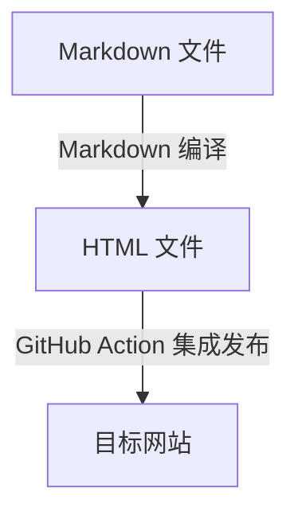

Rainforest Blog 是一个读取 Markdown 文件生成 HTML 文件的网站生成器。你可以点击[例子](http://blog.lijunlin.xyz)查看它生成的网站。

Rainforest Blog 是作者毕业设计——《自动软件生成系统的研究与实践》顺手写下的作品，用来探究使用模板生成代码的方案。

# 目录

[toc]
# 1 支持功能

## 1.1 Markdown 的基本语法

如果你还不了解 Markdown，请先自行学习一些[Markdown 教程](https://commonmark.org/help/)

## 1.2 Markdown 扩展语法

| 名称     | 源代码             | 效果                                                         |
| -------- | ------------------ | ------------------------------------------------------------ |
| 上标     | `x^2^`             | <code>x^2^</code>                                            |
| 下标     | `x~2~`             | <code>x~2~</code>                                            |
| 高亮     | `==xxxxxxxx==`     | ==xxxxxxxx==                                                 |
| 任务列表 | `- []`<br/>`- [x]` | <input type="checkbox" /><br/><input type="checkbox" checked /> |
| 目录     | `[toc]`            | 读取一二级标题生成目录                                       |

## 1.3 Latex 数学公式

支持 Latex 语法行内数学公式和块级数学公式

行内数学公式使用 `$` 包裹，`$y=ax^2 + bx + c$` 效果为 <code>$y=ax^2 + bx + c$</code>

块级数学公式使用 `$$` 包裹

```latex
$$
\int u \frac{dv}{dx}\, dx=uv-\int \frac{du}{dx}v\,dx
$$
```

效果为
$$
\int u \frac{dv}{dx}\, dx=uv-\int \frac{du}{dx}v\,dx
$$

## 1.4 Mermaid 画图

内置了 mermaid 画图，可以参考 [mermaid 教程](https://mermaid-js.github.io/)，可以画流程图、类图、饼图等等

# 2 它是如何工作的



Rainforest Blog 站点本质上是一个多页应用，它会将所有 Markdown 文件均编译为 HTML 文件，其中 `README.md` 文件会编译为 `index.html` 文件。

所有的 Markdown 文件均存储在 post 文件夹下，编译后生成的 HTML 文件则在 dist 文件夹下。

举例来说，如果  post 文件结构为：

```
post
|--2022
|  |--README.md
|  |--theme.md
|--README.md
|--introduction.md
|--config.md
|--setting.md
```

则生成的 dist 文件结构为：

```
dist
|--2022
|  |--index.html
|  |--theme.html
|--index.html
|--introduction.html
|--config.html
|--setting.html
```

# 3 目标用户

尽管博主自身使用 Rainforest Blog 自动生成个人博客，但相比 VuePress 和 Hexo 等静态网站生成器，Rainforest Blog 无疑简陋很多。

因此 Rainforest Blog 的目标用户，是渴望了解静态博客生成原理，有一定折腾能力，且熟悉 JavaScript 编程的同学。

# 4 关于博主

我叫李俊霖，是北京理工大学计算机学院 2022 届的毕业生，一名前端工程师，想知道更多关于我的信息，可以查看我的简历。
