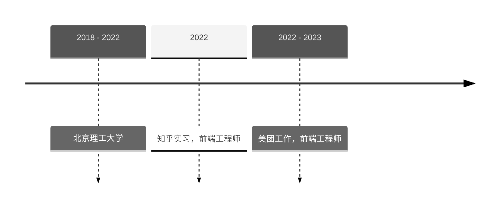
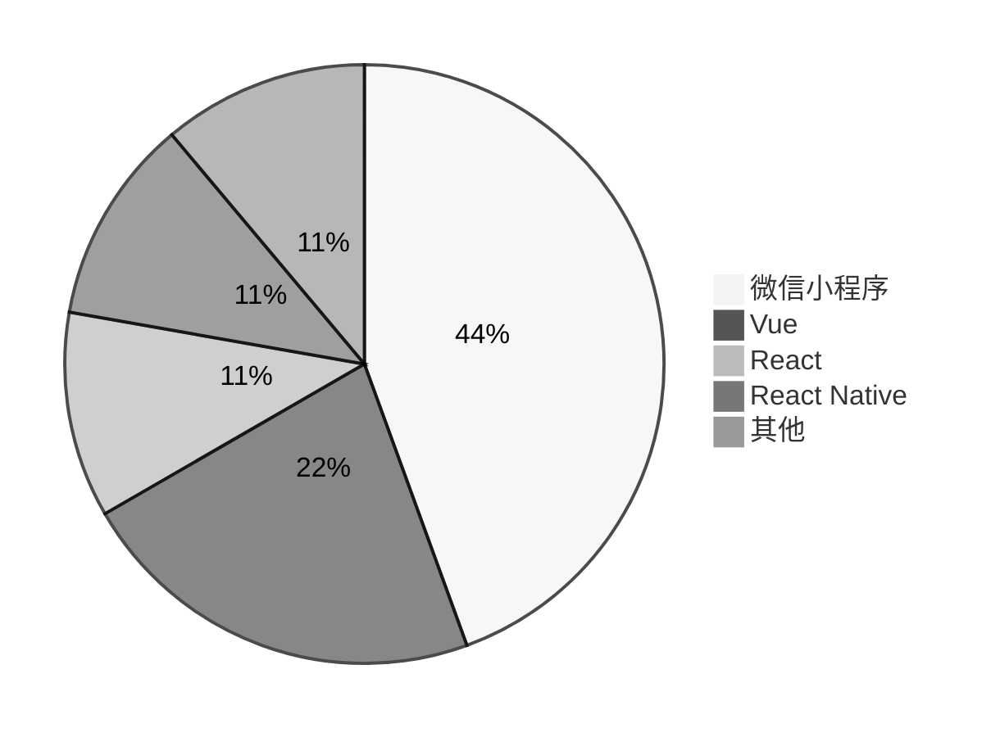

## 个人简介

你好哇，我是李俊霖。

## 我的经历

```mermaid
%%{init: { 'logLevel': 'debug', 'theme': 'neutral' } }%%
timeline
      2018 - 2022 : 北京理工大学
      2022 : 知乎实习，前端工程师
      2022 - 2023 : 美团工作，前端工程师
```

## 我的技能

```mermaid
%%{init: { 'pie' : { 'textPosition': 0.4 },'logLevel': 'debug', 'theme': 'neutral', 'themeVariables': { 'pieOuterStrokeWidth' : '0px' } } }%%
pie
  "微信小程序" : 40
  "Vue" : 20
  "React" : 10
  "React Native" : 10
  "其他" : 10
```
