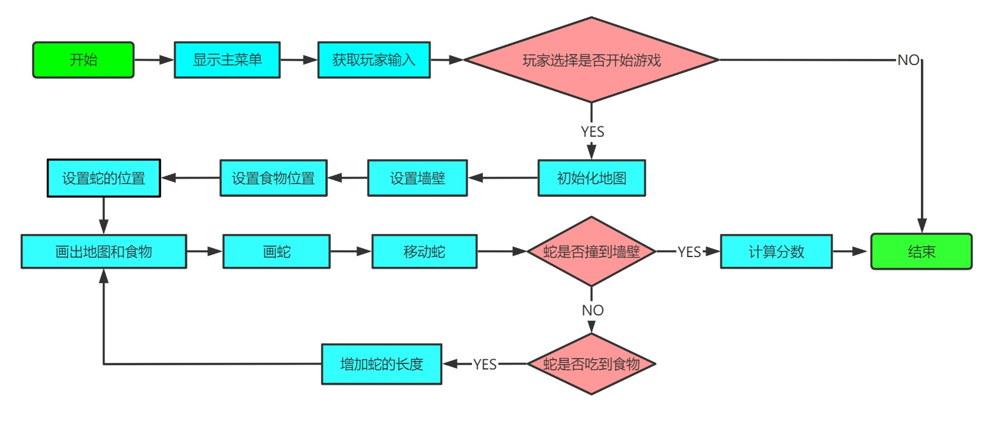

完全从 0 开始直接写一个贪吃蛇游戏是非常困难的，博主首先使用 C 嵌套汇编完成了贪吃蛇游戏的编写，之后将 C 嵌套汇编完全翻译为 Windows 32 位的纯汇编，从而完成了纯汇编的贪吃蛇游戏

## 面临的困境

BIT 汇编语言的大作业是用汇编写一个游戏，博主从 5 月 1 日开始编写游戏，到 5 月 19 日基本完整所有功能，其中颇多辛酸，不足为外人道也

32 位汇编在网络上的资料比较少，即使偶尔找到一个能够运行的代码，几乎都是几千行且没有注释，参考价值微小。16 位汇编能够找到的资料倒是比较多，但由于 BIT 大作业要求是 32 位汇编，参考价值也微小。（16 位汇编可以直接调用中断实现光标移动等等，但 32 位汇编却需要调用操作系统提供的函数）

目前 32 位汇编的书籍，大致分为两类

- 以 《Windows 环境下 32 位汇编语言程序设计（罗云彬）》为代表，这些书与其说是讲解汇编语言，不是说是讲解 Windows 的 API，因为书中大量使用封装后的汇编语言

  个人认为，封装后的汇编语言处于一个尴尬的位置，既没法帮助人了解底层，也没有高级语言操作方便。我不是很想花精力去研究它

- 以 《Intel 汇编语言程序设计》为代表，这类书详细讲解了汇编的基础原理。和传统的编程语言书籍差不多，学完后你之后写算法题，无法做工程

## 打破困境的方法

于是博主一开始是使用 C 嵌套汇编写的游戏，之后博主逐渐感受到先使用 C 嵌套汇编的好处：

- C 嵌套汇编可以直接在 C 环境下编译，配置环境很简单
- C 的函数比汇编函数更容易理解，C 中能使用局部变量，而汇编中则全部是全局变量
- 使用 C 可以随时反汇编，查看汇编代码
- 在 C 中 debug 比在汇编中 debug 要轻松得多

博主目前已经完成了 C 嵌套汇编翻译为纯汇编的工作，自我感觉翻译的过程还是蛮简单的，只花了大概两天

## 游戏流程

## 项目代码

[assembly-snake | GitHub](https://github.com/lijunlin2022/assembly-snake)
