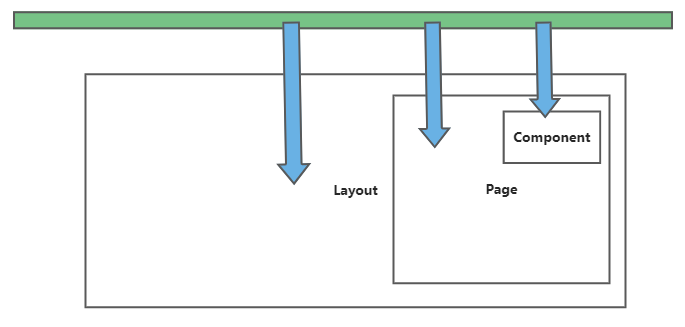

  
时间、地点、事件

- 2022 年
- 知乎/智者四海(北京)技术有限公司
- 实习，改造中后台项目

## 背景

效能平台的 URL 很多不符合公司规范，我们统计后，大致归类为两种问题：

- 本应放到 `query` 参数位置的东西放到了 `params` 参数里面。举例来说：
  - `/task/tab/team` 应该改为 `/task?tab=team`
  - `/task/tab/mine` 应该改为 `/task?tab=mine`
- 唯一的，非中文的资源没有资源名而使用资源 Id，举例来说：
  - `/app/:appId/xxx` 应该改为 `/app/:appName/xxx`（后来我们发现，`appName` 无法唯一标识资源，需要使用 `appType + appName` 才能唯一标识，于是应该改为 `/app/:appType/:appName/xxx`）

## 目标

- 兼容旧的 URL。效能平台的 URL 被其他平台大量使用，如果 URL 失效了，会大面积地影响他人的工作
- 尽可能不要影响原本的业务逻辑，少改动代码

## 挑战

- 第一个挑战是：如何兼容旧的 URL？
- 第二个挑战描述如下：
  - 阅读代码后，发现原始的业务非常依赖 appId，且几乎所有的代码都是通过 umi 的 `useParams()` 直接从 URL 上取到 appId，是一个同步的过程。
  - 将路由从 `/app/:appId/xxx` 修改为 `/app/:appType/:appName` 之后，我们需要从 URL 取出 appType 和 appName，发送网络请求给后端，用 appType 和 appName 换取 appId，是一个异步的过程。
  - 如果直接走这样的逻辑，会造成大量的代码无法及时取到 appId，因而失效。

## 方法

为了方便解释，我先用示意图画出原本的业务逻辑：

- 绿色的矩形代表原本的 /app/:appId 路由
- 下方是层层嵌套的组件，Layout 包裹着 Page，Page 又包裹着 Component
- 蓝色的箭头代表直接从路由中获取 appId，是一个同步过程

我们的方法是：

1. 用正则表达式匹配到访问旧路由时，会先拆解出 appId
2. 发送网络请求给后端，换取 appType 和 appName
  - 未换取到 appId 之前，Wrapper 一直处于 Loading 状态。
  - 换取到 appId 之后，将 appId 存储到上下文 AppStateCtx 中
  - 任何被 Wapper 包裹的组件，都可以使用 `useContext(AppStateCtx)` 来获取到 appId
3. 拼接 /app/:appType/:appName 的字符串，转发到新路由

## 缺陷

目前来看，这样做有两个缺陷：

- 加载时间变长
  - 如果输入旧的 URL，将经历两次网络请求后才走正常的业务逻辑
  - 如果输入新的 URL，将经历一次网络请求后才走正常的业务逻辑
- 无法再次修改 URL
  - 如果新的 URL 由被改变，那么兼容前两次的 URL 将变得非常困难

