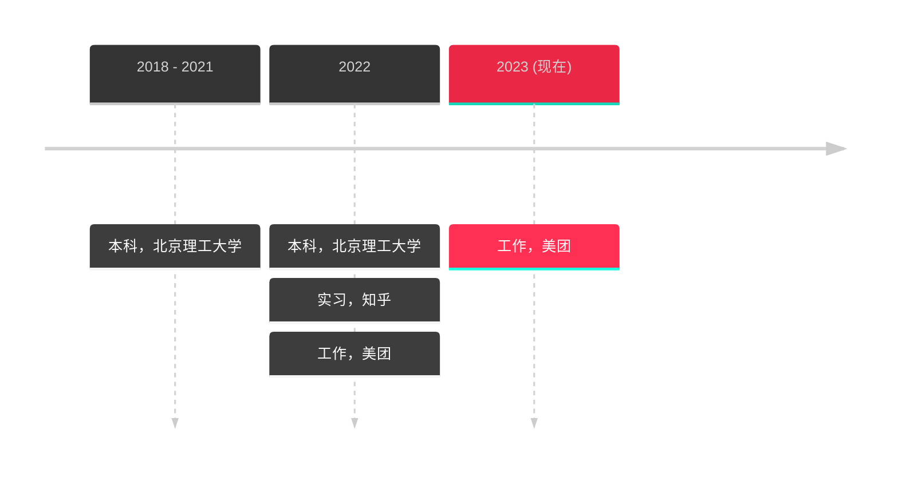

[English Blog Link](https://lijunlin2022.github.io/en-blog/index.html)

## 自我介绍

  你好哇，我是李俊霖。

## 我的经历

```mermaid
%%{
  init: {
    'logLevel': 'debug',
    'theme': 'dark',
    'themeVariables': {
      'cScale0': '#333333',
      'cScale1': '#333333',
      'cScale2': '#ea2845',
      'cScale3': '#333333',
      'cScale4': '#333333',
      'cScale5': '#333333',
      'cScale6': '#333333',
      'cScale7': '#333333',
      'cScale8': '#333333',
      'cScale9': '#333333',
      'cScale10': '#333333',
      'cScale11': '#333333'
    }
  }
}%%
timeline
  2018 - 2021 : 本科，北京理工大学
  2022 : 本科，北京理工大学 : 实习，知乎: 工作，美团
  2023 (现在): 工作，美团
```
