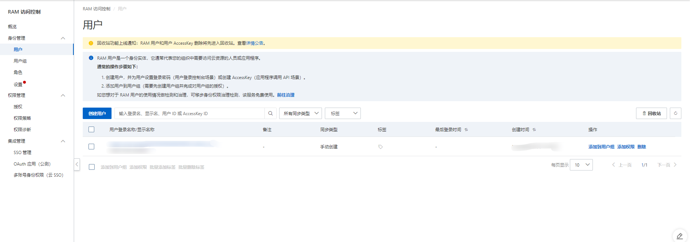

# NestJS 使用 OSS 上传图片

首先需要到阿里云的`身份管理/用户`中创建一个用户账号，



创建好用户后，我们可以给这个用户账号创建 AccessKey，这样就可以拿用户账号访问阿里云的 API 了。


有两种 API 上传图片到阿里云的方式。

- 服务端转发
  - 用服务端转发的话，请求我们自己的服务器会被收取一次费用，上传图片又会再收取一次费用
- Web 直传
  - 服务端会生成一个签名，然后将签名传递给客户端
  - 客户端通过签名，上传图片到阿里云 OSS

我们这里选择 Web 直传的方式，文档可以参考[服务端签名后直传](https://help.aliyun.com/document_detail/31926.html)

之后需要给用户组设置权限。


然后需要设置跨域


之后读和写都需要权限，我们这里需要设置公共读

https://help.aliyun.com/document_detail/177701.html?spm=a2c4g.149373.0.0.318f1955bLrLYc

## 服务端获取签名

```ts
import { Injectable } from '@nestjs/common';
import * as OSS from 'ali-oss';
import * as dayjs from 'dayjs';

import {
  aliyunAccessKeyId,
  aliyunAccessKeySecret,
  aliyunBucket,
} from 'src/password.config';
import { OSSType } from './dto/oss.type';

@Injectable()
export class OSSService {
  async getSignature(): Promise<OSSType> {
    const config = {
      accessKeyId: aliyunAccessKeyId,
      accessKeySecret: aliyunAccessKeySecret,
      bucket: aliyunBucket,
      dir: 'images/',
    };
    const client = new OSS(config);
    const date = new Date();
    date.setDate(date.getDate() + 1);
    const policy = {
      expiration: date.toISOString(), // 请求的超时时间。
      conditions: [
        ['content-length-range', 0, 1048576], // 设置上传文件的大小限制 1MB
      ],
    };

    // 调用SDK获取签名
    const formData = await client.calculatePostSignature(policy);

    return {
      expire: dayjs().add(1, 'days').unix().toString(),
      policy: formData.policy,
      signature: formData.Signature,
      accessId: formData.OSSAccessKeyId,
    };
  }
}
```
