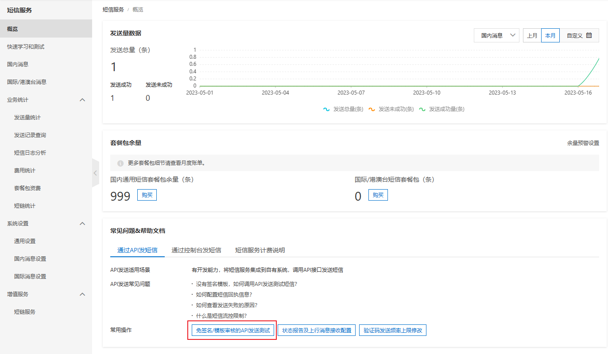
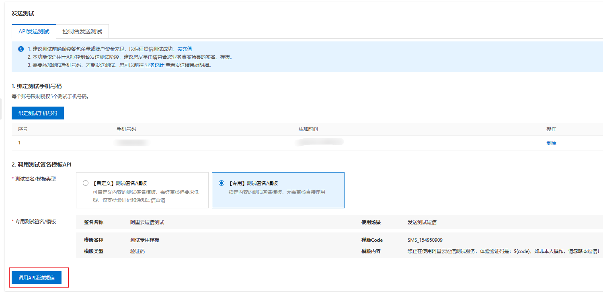
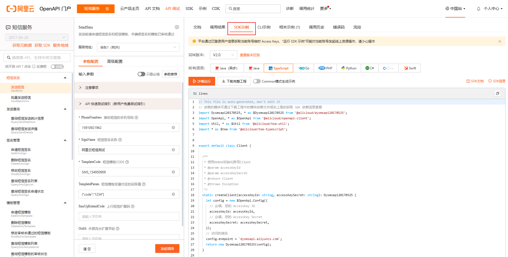

# 阿里云短信服务

我们开发一个产品时，往往需要用到短信验证码功能，为此我们可以选择「阿里云短信服务」。

可以访问 [阿里云短信服务](https://dysms.console.aliyun.com/overview)。

## 使用测试模板

选择「通过 API 发短信」->「免签名/模板审核的 API 发送测试」

为了快速上手阿里云短信服务，我们在绑定测试手机号后，可以先不选择申请模板，而是先使用「【专用】测试签名/模板」。

之后我们可以直接点击调用，看看是否有验证码发送到我们的手机上。

## 编写调用的 API 的代码

我们可以选择「SDK 示例」，查看相关语言的例子，因为我使用的是 Nest.js，所以选择 TypeScript。

